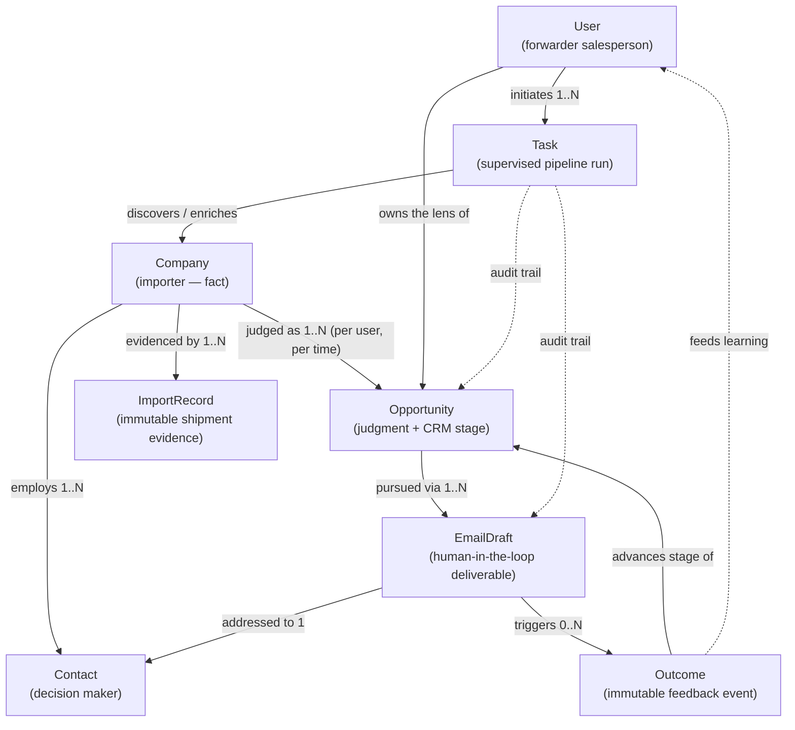

# Business Domain — US Importer Hunter

> v2 (Sprint 2, Lesson 2). The business model of the product, written
> before any persistence design. This document answers *what things exist
> in the business, how they live, and what they can do* — not how they are
> stored. Database modeling comes later and must conform to this document,
> not the other way around.

## The business in one paragraph

A freight forwarder's salesperson wants to win US importers as customers.
Winning requires knowing **who imports** (Company), **proof that they
ship** (ImportRecord), **whether they are worth pursuing** (Opportunity),
**who to talk to** (Contact), **what to say** (EmailDraft) — personalized
to what *this* forwarder is actually good at (User), executed in
supervised runs (Task), and improved by **what actually happened**
(Outcome). The system does the research and writing; the human sells.

## The three-layer rule (fact / judgment / artifact)

| Layer | Entities | Mutability |
|---|---|---|
| **Evidence** | ImportRecord, Outcome | Immutable events — accumulated, never edited |
| **Facts** | Company, Contact | Enriched over time, deduplicated, source-tracked |
| **Judgments** | Opportunity | Recomputable from evidence + user lens |
| **Artifacts** | EmailDraft, Task | Versioned work products with lifecycle states |
| **Principal** | User | The lens everything above is computed through |

Any judgment traces down to evidence; any artifact traces back to the
judgment and prompt version that produced it; any outcome feeds back into
future judgments. This closed loop is the product.

---

## 1. Company — the importer as a real-world fact

**Purpose.** One canonical identity per real-world US importer. Every data
source (customs records, Google, websites, LinkedIn) describes fragments
of the same buyer under slightly different names; without a canonical
company, volume is undercounted, outreach is duplicated, and enrichment is
wasted. A Company carries only what is objectively knowable — whether it
is *worth pursuing* lives in Opportunity.

**Lifecycle.**
```
discovered → enriching → profiled → stale → re-enriched → …
                 ↘ merged (dedup absorbs a duplicate into the canonical record)
                 ↘ archived (out of business / irrelevant)
```
"Stale" is a business state, not an error: shipping behavior ages fast,
and a profile older than its data-source refresh window must not be
scored as current.

**Behaviors.**
- `merge(duplicate)` — absorb another record for the same real company,
  keeping source lineage of every field.
- `enrich(source, data)` — accept new facts with provenance; conflicting
  facts resolve by source trust + recency policy.
- `derive_shipping_profile()` — recompute lanes / volumes / cadence /
  incumbent forwarders by aggregating its ImportRecords.
- `mark_stale()` / `refresh()` — age out, then re-run enrichment.

**Relationships.** Has many ImportRecords (evidence), many Contacts, many
Opportunities (one per user-lens/time); produced and updated inside Tasks.

**Ownership.** Agent: **research** (discovers and enriches via tools).
Workflows: lead_generation, research. Services: company (lifecycle/dedup),
search, scoring (reads), rag.

---

## 2. Opportunity — the forwarder's judgment about a company

**Purpose.** The first-class object for "worth pursuing, this much, right
now, for this reason" — plus the pursuit's CRM life. Separating judgment
from fact lets the same importer be a gold prospect for a China→LA
furniture forwarder and worthless for an EU pharma specialist, and lets
scores be recomputed when evidence or the user's profile changes.

**Lifecycle.**
```
identified → scored → qualified ──→ contacted → engaged → negotiating → won
                    ↘ disqualified(reason)         ↘ dormant → re-opened   ↘ lost(reason)
```
Stage transitions are business rules (`domain/crm`): e.g. `engaged`
requires a positive Outcome; `dormant` triggers after N days without
response; `won/lost` require a reason for learning.

**Behaviors.**
- `score()` / `rescore()` — deterministic scoring service computes score +
  breakdown from company facts × user lens; always re-derivable.
- `explain()` — return the score breakdown (which dimensions, which
  evidence) for user trust.
- `advance_stage(event)` / `disqualify(reason)` — CRM transitions guarded
  by domain rules.
- `go_dormant()` / `reopen(trigger)` — staleness and revival (e.g. new
  shipment burst detected).

**Relationships.** Belongs to one Company and one User (the lens); has
many EmailDrafts (pursuit artifacts) and many Outcomes (what happened);
created inside a Task.

**Ownership.** Agent: **research** (produces the qualitative analysis);
the numeric score is owned by the **scoring service** — deliberately not
an LLM, so ranking is explainable and reproducible. Workflows:
lead_generation (creates), followup (advances), email (reads context).
Services: scoring, company.

---

## 3. Contact — the human who reads the email

**Purpose.** Companies don't answer cold emails; a logistics manager does.
Contact holds the person, their role relevance, how to reach them, and
where that information came from (provenance matters commercially and
legally).

**Lifecycle.**
```
found → verified (address deliverable) → active → bounced / departed → replaced
```
A bounced or departed contact is never deleted — outreach history hangs
off it — but it stops being selectable as a recipient.

**Behaviors.**
- `verify()` — confirm deliverability / role currency before any draft is
  addressed to them.
- `mark_bounced()` / `mark_departed()` — invalidate as recipient, trigger
  replacement search.
- `record_provenance(source)` — every contact knows how it was obtained.
- `best_recipient(company, purpose)` — company-level selection rule:
  prefer logistics/supply-chain roles, verified addresses, no recent
  bounces.

**Relationships.** Belongs to one Company; receives many EmailDrafts;
Outcomes (reply/bounce) attribute to the draft *and* the contact.

**Ownership.** Agent: **research** (finds people via linkedin/website
tools). Workflows: lead_generation, email, followup. Services: email
(recipient selection), company.

---

## 4. ImportRecord — the shipment evidence

**Purpose.** The product's unfair advantage: one customs / bill-of-lading
observation (date, HS code, origin, ports, volume, carrier, incumbent
forwarder). Everything persuasive the system says traces back to these
records — qualification (real volume on real lanes), switching signals
(incumbent forwarder, cadence gaps), and personalization ammunition.

**Lifecycle.**
```
ingested → normalized (units/ports/names standardized) → linked (to a Company)
```
Then **immutable forever**. Records are never edited or enriched;
corrections arrive as new records from the source. Companies and
Opportunities are *derived* from aggregating them.

**Behaviors.**
- `normalize()` — standardize units (TEU/kg), port codes, party names at
  ingestion; the raw source payload is preserved alongside.
- `link(company)` — attach to a canonical Company (re-linkable when a
  merge changes canonical identity — the only mutable thing about it).
- Aggregation queries (by lane / HS / period / forwarder) are read-side
  behaviors consumed by `derive_shipping_profile()` and scoring.

**Relationships.** Belongs to (at most) one Company; referenced by
Opportunity score breakdowns and EmailDraft personalization claims.

**Ownership.** Agent: none — raw material. The **importyeti tool**
produces records; the research agent consumes them. Workflows:
lead_generation, research. Services: search, company, scoring.

---

## 5. EmailDraft — the deliverable, with a human in the loop

**Purpose.** The pipeline's end product the user touches. Deliberately a
*draft*: the MVP never sends autonomously — the salesperson reviews,
edits, approves and owns the send. The entity records what was generated,
from which analysis, with which prompt version, and everything that
happened to it afterwards.

**Lifecycle.**
```
generating → drafted → edited* → approved → sent → replied / bounced / no_response
     ↘ regenerated (new version, lineage kept)          (*edited is optional, repeatable)
```
Send-state transitions (`sent`, `replied`, `bounced`) are recorded from
user action or mailbox signals — never initiated by the system in MVP.

**Behaviors.**
- `generate(opportunity, contact, user_lens)` — sales agent composes from
  analysis + shipping evidence + user strengths; stamps prompt version.
- `regenerate(feedback)` — new version with user guidance; previous
  versions retained for learning.
- `edit(user_changes)` — capture human edits (the diff is a learning
  signal: what did the human fix?).
- `approve()` / `record_sent()` / `attach_outcome(outcome)` — human-gated
  transitions.

**Relationships.** Belongs to one Opportunity; addressed to one Contact;
carries prompt-version lineage; Outcomes attribute to it; created inside
a Task.

**Ownership.** Agent: **sales**. Workflows: lead_generation (draft step),
email (generate/regenerate), followup (sequenced drafts). Services: email
(composition/status), llm (via agent).

---

## 6. Task — a supervised unit of pipeline work

**Purpose.** A hunt run is long-running, fans out across dozens of
companies, costs real money (LLM tokens, data credits) and can fail
halfway. Task makes runs **visible, resumable, auditable**: what was
requested, what plan was derived, what ran, what it cost, what it
produced. It is about *work*, never business judgment.

**Lifecycle.**
```
planned → queued → running (step/fan-out progress) → completed
                        ↘ failed(diagnosis) → resumed / retried
                        ↘ cancelled (user)
```
(Naming note: distinct from `app/tasks/` — the Celery entry-point layer.
A queue task *executes* part of a domain Task.)

**Behaviors.**
- `plan(user_goal)` — planner agent turns a goal into an executable
  blueprint; the plan is the task's contract.
- `start()` / `report_progress(step, unit)` — live visibility per fan-out
  unit (company N of M).
- `fail(error, diagnosis)` / `resume()` — partial results are kept;
  resume continues from the last completed unit.
- `cancel()` — user-initiated, graceful.
- `account_cost()` — tokens, data credits, wall time (observability reads
  from tracing).

**Relationships.** Initiated by one User; produces/updates Companies,
Opportunities, EmailDrafts (audit trail); every observability trace hangs
off its identity.

**Ownership.** Agent: **planner** (owns the blueprint); every agent works
inside one. Workflows: all four — each execution is a Task. Services:
none own it; the workflow engine creates it, `app/tasks/` executes it
asynchronously later, observability records against it.

---

## 7. Outcome — what actually happened (the learning signal)

**Purpose.** The feedback event that closes the loop: a reply (positive /
negative / referral), a bounce, a meeting booked, a quote requested, a
deal won or lost. Without Outcomes the system generates forever without
learning *which lanes, angles and templates convert*. Outcomes are the
raw material for memory (long_term), for scoring calibration, and for
honest reporting ("40 drafts → 6 replies → 2 meetings").

**Lifecycle.**
```
recorded (immutable event) → attributed (to draft / opportunity / contact) → learned
```
"Learned" means ingested by the memory layer and available to future
scoring/prompting — the event itself never changes.

**Behaviors.**
- `record(type, evidence, when)` — capture the event with its proof
  (reply text, bounce code, meeting invite); user-reported in MVP.
- `attribute(draft, opportunity, contact)` — bind the event to what
  caused it; drives CRM stage transitions (`engaged` requires a positive
  outcome).
- `feed_learning()` — hand to memory/long_term and scoring calibration;
  report agent aggregates outcomes into funnel metrics.

**Relationships.** Attributes to one EmailDraft (usually), one
Opportunity, one Contact; consumed by memory, scoring, and the report
agent's funnel reporting.

**Ownership.** Agent: none generates it — outcomes come from reality
(user reports them in MVP; mailbox integration later). The **report**
agent aggregates them; memory and scoring consume them. Workflows:
followup (outcome-driven sequencing), lead_generation (reporting).
Services: email (send-state sync), scoring (calibration), memory layer.

---

## 8. User — the forwarder salesperson the system works for

**Purpose.** Every judgment and every email is *from someone*. The user's
profile — strong lanes, rate advantages, specialties, tone preferences,
targeting criteria — is what turns generic output into credible output.
Also the future tenancy boundary (data isolation, per-user pipelines),
even though MVP runs single-user.

**Lifecycle.**
```
created → profiled (strengths/targeting captured) → active → (multi-tenant: suspended/removed)
```
The profile is never "done": memory/user accumulates preferences from
edits, outcomes and explicit settings continuously.

**Behaviors.**
- `set_profile(lanes, strengths, specialties)` — the selling lens.
- `set_targeting(criteria)` — what a good prospect looks like for them.
- `record_preference(signal)` — implicit learning from draft edits and
  outcome patterns (via memory/user).
- `own(everything)` — all Tasks, Opportunities and EmailDrafts are
  scoped to a user from day one, so multi-tenancy is a filter, not a
  migration.

**Relationships.** Initiates Tasks; owns Opportunities (the lens) and
EmailDrafts; profile feeds planner, scoring and sales prompts.

**Ownership.** Agent: none — the user is the principal, not a work
product. planner consumes user context first; `memory/user` accumulates
it. Workflows: all. Services: all (context); auth/tenancy attaches here
later.

---

## Domain relationship diagram



Reading it as a sentence: *a **User** starts a **Task**; the task turns
**ImportRecords** into deduplicated **Companies** with **Contacts**; each
company is judged into an **Opportunity** through the user's lens;
pursuing it produces **EmailDrafts** addressed to contacts; reality
answers with **Outcomes**, which advance the opportunity's stage and teach
the system what works — and the task keeps the audit trail of all of it.*

## Ownership matrix

| Entity | Owning agent | Workflows | Depending services |
|---|---|---|---|
| Company | research | lead_generation, research | company, search, scoring, rag |
| Opportunity | research (analysis) / scoring service (score) | lead_generation, followup, email | scoring, company |
| Contact | research | lead_generation, email, followup | email, company |
| ImportRecord | — (evidence; importyeti tool produces) | lead_generation, research | search, company, scoring |
| EmailDraft | sales | lead_generation, email, followup | email, llm |
| Task | planner (blueprint) | all | — (workflow engine + observability) |
| Outcome | — (reality; report agent aggregates) | followup, lead_generation | email, scoring, memory |
| User | — (principal) | all | all (context) |

## Consistency notes & follow-ups

- `specs/company.yaml` mixes company facts with a `scoring` block — per
  this document that judgment belongs to **Opportunity**. Follow-up:
  split into `company.yaml` + `opportunity.yaml` (specs first, ADR-0006).
- `app/domain/` today has `company/ contact/ email/ crm/`. This document
  maps `crm` rules to **Opportunity** stage transitions; `ImportRecord`,
  `Task`, `Outcome`, `User` need domain homes when their rules are
  implemented.
- Outcome is user-reported in MVP; mailbox integration (reply/bounce
  detection) is a later-sprint decision.
- Open product questions (docs/prd.md) unchanged; ImportRecord's exact
  fields depend on the ImportYeti access decision.
