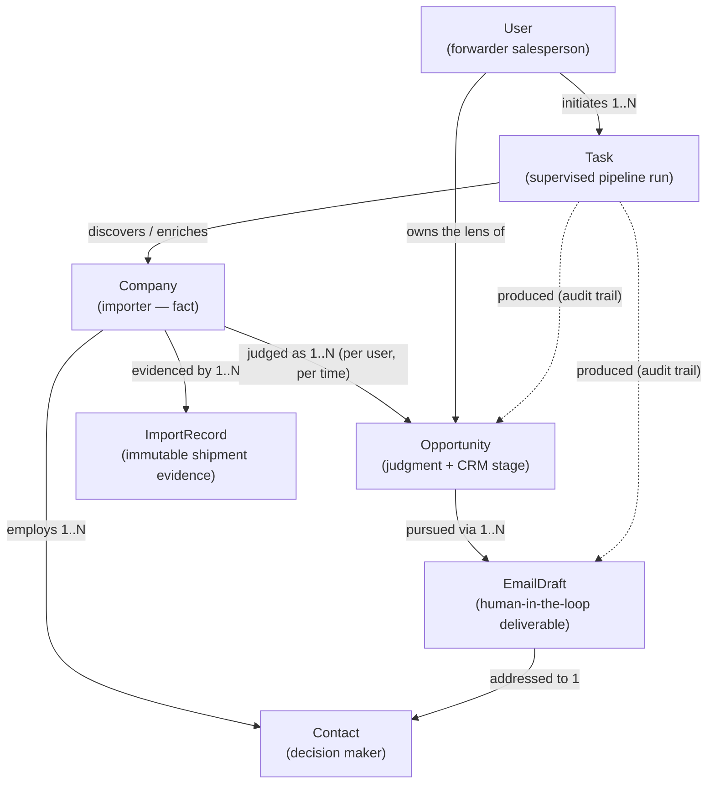

# Business Domain — US Importer Hunter

> The business model of the product, written before any persistence design.
> This document answers *what things exist in the business and why* — not
> how they are stored. Database modeling comes later and must conform to
> this document, not the other way around.

## The business in one paragraph

A freight forwarder's salesperson wants to win US importers as customers.
Winning requires knowing **who imports** (companies), **proof that they
ship** (import records), **whether they are worth pursuing** (opportunities),
**who to talk to** (contacts), and **what to say** (email drafts) — all of
it personalized to what *this* forwarder is actually good at (user). The
system does that work in supervised runs (tasks), so the human sells
instead of researching.

---

## Core entities

### 1. Company — the importer as a real-world fact

- **Why it exists**: every data source (customs records, Google, websites,
  LinkedIn) describes fragments of the same real-world importer under
  slightly different names. The business needs one canonical identity per
  importer — otherwise volume is undercounted, outreach is duplicated, and
  two salespeople chase the same prospect twice.
- **Business problem it solves**: *"Is 'Pacific Home Goods Inc.' and
  'PACIFIC HOME GOODS' the same buyer, and what do we actually know about
  them?"* — identity, deduplication, and accumulated enrichment.
- **Key distinction**: a Company is a **fact**, not a judgment. It carries
  what is objectively knowable (location, industry, products, HS codes,
  shipping behavior derived from import records). Whether it is *worth
  pursuing* is not stored here — that is the Opportunity's job.
- **Owning agent**: `research` (discovers and enriches it through tools).
- **Workflows**: `lead_generation` (created/enriched during the research
  fan-out), `research` (on-demand deep-dive refresh).
- **Services**: `company` (lifecycle, dedup, enrichment merge policy),
  `search` (find/list), `scoring` (reads it as input), `rag` (company
  facts become retrievable context).

### 2. Opportunity — the forwarder's judgment about a company

- **Why it exists**: the same importer is a great prospect for a forwarder
  strong on China→LA furniture lanes and a poor one for a forwarder
  specialized in EU pharma airfreight. The judgment "worth pursuing, this
  much, right now, for this reason" is a first-class business object,
  separate from the company it judges. It also carries the pursuit's CRM
  life: new → researched → contacted → replied → won/lost.
- **Business problem it solves**: *"I have 1,000 importers — which ten do
  I contact this week, and why?"* — prioritization with an explainable
  score, and *"where does each pursuit stand?"* — pipeline tracking.
- **Key distinction**: Opportunity = Company × User's strengths × time.
  Re-scoring after new shipment data, or for a different user, creates a
  different judgment — the company fact stays untouched.
- **Owning agent**: `research` (produces the analysis the judgment rests
  on); the numeric score itself comes from the deterministic `scoring`
  service — by design, so ranking is explainable and reproducible.
- **Workflows**: `lead_generation` (score step creates it), `followup`
  (advances its CRM stage over time), `email` (reads it for context).
- **Services**: `scoring` (creates/updates score + breakdown), `company`
  (source facts), future CRM logic lives against this entity
  (`domain/crm` rules: stage transitions, staleness).

### 3. Contact — the human who reads the email

- **Why it exists**: companies don't answer cold emails; a logistics
  manager or supply-chain director does. Outreach quality depends on
  reaching the right role with a deliverable address.
- **Business problem it solves**: *"Who at Pacific Home Goods decides
  freight, and how do I reach them?"* — plus compliance: contact data
  provenance (where did we get this email?) matters commercially.
- **Owning agent**: `research` (finds people via linkedin/website tools).
- **Workflows**: `lead_generation` (contact discovery during research),
  `email` (recipient selection), `followup` (thread continuity per person).
- **Services**: `email` (addresses drafts to contacts), `company`
  (contacts belong to a company's profile).

### 4. ImportRecord — the shipment evidence

- **Why it exists**: this is the product's unfair advantage. A single
  customs / bill-of-lading row (date, HS code, origin, ports, volume,
  carrier, **current forwarder**) is objective evidence of shipping
  behavior. Everything persuasive the system says — "you shipped ~40
  containers of furniture from Shanghai last quarter" — traces back to
  these records.
- **Business problem it solves**: three at once:
  1. **Qualification** — real volume on real lanes, not claimed volume.
  2. **Switching signals** — who the incumbent forwarder is, whether
     volume is shifting, gaps in shipping cadence.
  3. **Personalization ammunition** — specific, verifiable facts that make
     a cold email read like homework was done.
- **Key distinction**: ImportRecords are **immutable observations**. They
  are never edited or "enriched" — companies and opportunities are
  *derived* from aggregating them.
- **Owning agent**: none owns it — it is raw material. The `importyeti`
  tool produces records; the `research` agent consumes them.
- **Workflows**: `lead_generation` and `research` (evidence gathering).
- **Services**: `search` (query by lane/HS/period), `company`
  (aggregation into shipping profile), `scoring` (volume/lane/switching
  dimensions read from aggregates).

### 5. EmailDraft — the deliverable, with a human in the loop

- **Why it exists**: the pipeline's end product the user actually touches.
  It is a **draft** deliberately: the MVP never sends autonomously — the
  salesperson reviews, edits, and owns the send. The entity records what
  was generated, from which analysis, with which prompt version, and what
  happened to it (drafted → edited → approved → sent → replied).
- **Business problem it solves**: *"Write me an email to this person that
  proves we did homework and pitches what we're actually good at"* — at
  scale, without surrendering the sender's reputation to automation.
- **Owning agent**: `sales` (generates it; regenerates on request).
- **Workflows**: `lead_generation` (draft step), `email`
  (generate/regenerate standalone), `followup` (sequenced follow-up drafts).
- **Services**: `email` (composition, status transitions), `llm` (via the
  sales agent), `scoring`/`company` (context inputs).

### 6. Task — a supervised unit of pipeline work

- **Why it exists**: a hunt run is long-running, fans out across dozens of
  companies, costs real money (LLM tokens, data credits), and can fail
  halfway. The business needs runs to be **visible, resumable, auditable**:
  what was requested, what ran, what it cost, what it produced. Task is
  the record of "the system did work on the user's behalf."
- **Business problem it solves**: *"What is the system doing right now,
  what did last night's run find, why did it fail, and what did it cost?"*
- **Key distinction**: Task is about **work**, not about prospects. It
  references the entities a run produced; it never contains business
  judgment itself. (Naming note: distinct from `app/tasks/`, the Celery
  entry-point layer — a queue task *executes* part of a domain Task.)
- **Owning agent**: `planner` (turns a user goal into an executable plan —
  the plan *is* the task's blueprint); every agent then works inside it.
- **Workflows**: all four — each workflow execution is tracked as a Task;
  `observability` (metrics/tracing) hangs off its identity.
- **Services**: none owns it; the workflow engine creates it, the
  `app/tasks/` layer executes it asynchronously later, observability
  records against it.

### 7. User — the forwarder salesperson the system works for

- **Why it exists**: every judgment and every email is *from someone*. The
  forwarder's own profile — strong lanes, rate advantages, specialties,
  tone preferences, targeting criteria — is the personalization input that
  turns generic output into credible output. It is also the future tenancy
  boundary (data isolation, per-user pipelines) even though MVP runs
  single-user.
- **Business problem it solves**: *"Don't pitch pharma airfreight when I
  sell China→LA furniture FCL"* — every Opportunity score and every
  EmailDraft is computed through this lens.
- **Owning agent**: none — the user is the principal, not a work product.
  `planner` consumes user context first; `memory/user` accumulates it.
- **Workflows**: all — every run starts from a user goal and user profile.
- **Services**: all read user context; auth/tenancy attaches here later.

---

## Domain relationship diagram

Reading the diagram as a sentence: *a **User** starts a **Task**; the task
turns **ImportRecords** into deduplicated **Companies** with **Contacts**;
each company is judged into an **Opportunity** through the user's lens;
pursuing an opportunity produces **EmailDrafts** addressed to contacts —
and the task keeps the audit trail of all of it.*

## Fact / judgment / artifact — the three-layer rule

| Layer | Entities | Mutability |
|---|---|---|
| **Evidence** | ImportRecord | Immutable — never edited, only accumulated |
| **Facts** | Company, Contact | Enriched over time, deduplicated, source-tracked |
| **Judgments** | Opportunity | Recomputable — score can always be re-derived from evidence + user lens |
| **Artifacts** | EmailDraft, Task | Versioned work products with lifecycle states |
| **Principal** | User | The lens everything above is computed through |

This rule is what keeps the system trustworthy: any judgment can be traced
down to evidence, and any artifact can be traced back to the judgment and
prompt version that produced it.

## Ownership matrix

| Entity | Owning agent | Workflows | Depending services |
|---|---|---|---|
| Company | research | lead_generation, research | company, search, scoring, rag |
| Opportunity | research (analysis) / scoring service (score) | lead_generation, followup, email | scoring, company |
| Contact | research | lead_generation, email, followup | email, company |
| ImportRecord | — (raw evidence; importyeti tool produces) | lead_generation, research | search, company, scoring |
| EmailDraft | sales | lead_generation, email, followup | email, llm |
| Task | planner (blueprint) | all | — (workflow engine + observability) |
| User | — (principal) | all | all (context) |

## Consistency notes & follow-ups

- `specs/company.yaml` currently mixes company facts with a `scoring`
  block — per this document that judgment belongs to **Opportunity**.
  Follow-up: split into `company.yaml` + `opportunity.yaml` (specs update
  first, per ADR-0006).
- `app/domain/` today has `company/ contact/ email/ crm/` — this document
  implies `crm` rules attach to **Opportunity**, and `ImportRecord`,
  `Task`, `User` need domain homes when rules for them appear.
- Open product questions (docs/prd.md) unchanged; ImportRecord's exact
  fields depend on the ImportYeti access decision.
