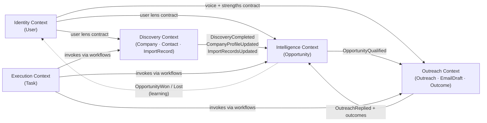
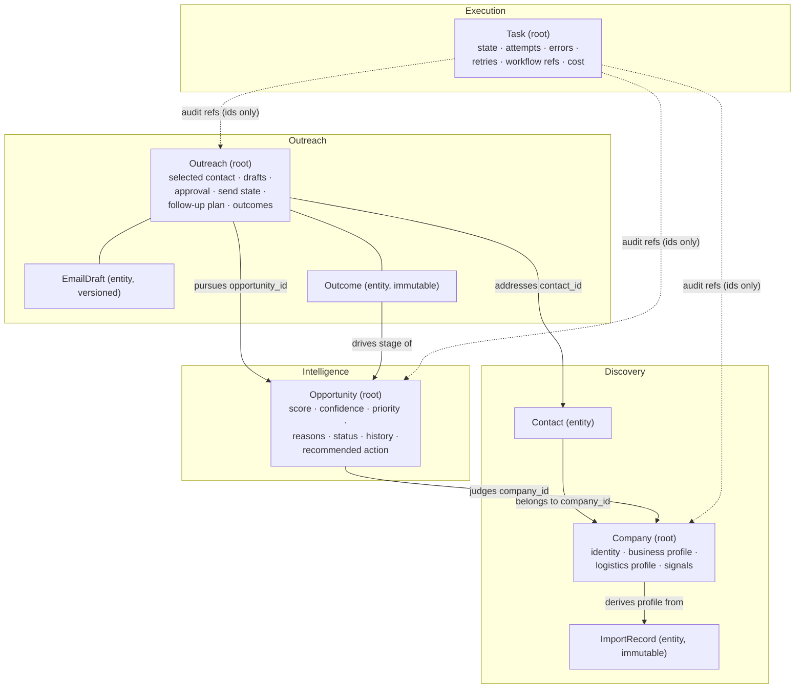

# Business Domain — US Importer Hunter

> v3 (Sprint 2, Lesson 3). The business model, refined with domain
> boundaries, aggregates and domain events — still written before any
> persistence design. Database modeling must conform to this document.
> Plain-English rule: every DDD term below is explained by what it means
> for a freight forwarder's sales workflow, or it doesn't belong here.

## The business in one paragraph

A freight forwarder's salesperson wants to win US importers as customers.
Winning requires knowing **who imports** (Company), **proof that they
ship** (ImportRecord), **whether they are worth pursuing** (Opportunity),
**who to talk to** (Contact), and **running the conversation** (Outreach,
with its EmailDrafts) — personalized to what *this* forwarder is actually
good at (User), executed in supervised runs (Task), and improved by
**what actually happened** (Outcome). The system does the research and
writing; the human sells.

## Official entity list

Nine entities, each owned by exactly one bounded context:

| Entity | Owning context | One-line role |
|---|---|---|
| Company | Discovery | The importer as a deduplicated real-world fact |
| Contact | Discovery | The human decision maker at an importer |
| ImportRecord | Discovery | One immutable customs/BoL shipment observation |
| Opportunity | Intelligence | The judgment: worth pursuing, how much, why — plus CRM stage |
| Outreach | Outreach | One pursuit conversation for one opportunity |
| EmailDraft | Outreach | One generated email version inside an outreach |
| Outcome | Outreach | One immutable feedback event from reality |
| Task | Execution | One supervised, resumable pipeline run |
| User | Identity | The forwarder salesperson — the lens and the tenant |

## The three-layer rule (fact / judgment / artifact)

| Layer | Entities | Mutability |
|---|---|---|
| **Evidence** | ImportRecord, Outcome | Immutable events — accumulated, never edited |
| **Facts** | Company, Contact | Enriched over time, deduplicated, source-tracked |
| **Judgments** | Opportunity | Recomputable from evidence + user lens |
| **Artifacts** | Outreach, EmailDraft, Task | Versioned work products with lifecycle states |
| **Principal** | User | The lens everything above is computed through |

Any judgment traces down to evidence; any artifact traces back to the
judgment and prompt version that produced it; any outcome feeds back into
future judgments. This closed loop is the product.

---

# Bounded contexts

A bounded context is a part of the business where words have one precise
meaning and one team of modules is responsible. "Score" means something
in Intelligence and nothing in Discovery; "attempt" means something in
Execution and nothing in Outreach. Contexts talk to each other only
through **typed contracts and domain events** — never by reaching into
each other's internals (ADR-0015).

## Discovery Context — "find importers and prove they ship"

- **Purpose**: turn messy external data into canonical companies with
  evidence and reachable people.
- **Responsibilities**: ingest and normalize import records; deduplicate
  and enrich companies; discover and verify contacts; keep profiles fresh
  (staleness).
- **Owned entities**: Company, Contact, ImportRecord.
- **Excluded responsibilities**: judging whether a company is worth
  pursuing (Intelligence); writing to anyone (Outreach).
- **Inputs**: user targeting criteria (Identity contract); raw data from
  tools (importyeti, google, website, linkedin).
- **Outputs**: events `DiscoveryCompleted`, `CompanyProfileUpdated`,
  `ImportRecordsUpdated`; canonical profiles readable by other contexts.
- **Depends on**: Identity (targeting lens). Runs inside Execution tasks.

## Intelligence Context — "decide who is worth pursuing, and why"

- **Purpose**: convert facts into prioritized, explainable, living
  judgments.
- **Responsibilities**: score opportunities (deterministic, explainable);
  qualify/disqualify; own the CRM stage machine; recommend next actions;
  recalibrate from outcomes.
- **Owned entities**: Opportunity.
- **Excluded responsibilities**: gathering data (Discovery); writing or
  sending anything (Outreach).
- **Inputs**: company profiles + evidence aggregates (Discovery); user
  lens (Identity); outcome events (Outreach).
- **Outputs**: events `OpportunityScoreChanged`, `OpportunityQualified`,
  `OpportunityDisqualified`, `OpportunityWon`, `OpportunityLost`;
  prioritized opportunity lists.
- **Depends on**: Discovery (facts), Identity (lens), Outreach (outcomes).

## Outreach Context — "run the sales conversation"

- **Purpose**: pursue qualified opportunities through personalized,
  human-approved communication, and capture what reality answers.
- **Responsibilities**: select the right contact; generate and version
  email drafts; enforce human approval before anything leaves; track send
  state and follow-up plans; record outcomes.
- **Owned entities**: Outreach (root), EmailDraft, Outcome.
- **Excluded responsibilities**: deciding *whether* to pursue
  (Intelligence decides; Outreach executes); discovering contacts
  (Discovery finds them; Outreach selects among them).
- **Inputs**: `OpportunityQualified` events + opportunity context
  (Intelligence); contact facts (Discovery); voice/strengths (Identity).
- **Outputs**: events `OutreachCreated`, `EmailDraftGenerated`,
  `EmailDraftApproved`, `OutreachSent`, `OutreachReplied`; outcome data
  consumed by Intelligence and memory.
- **Depends on**: Intelligence, Discovery, Identity.

## Execution Context — "run the machine, keep the receipts"

- **Purpose**: make long-running, fan-out, money-costing AI work
  visible, resumable and auditable.
- **Responsibilities**: turn user goals into executable plans (planner);
  track run state, attempts, errors, retries; account cost; emit
  completion/failure signals.
- **Owned entities**: Task.
- **Excluded responsibilities**: any business judgment — a Task knows
  *that* research ran and what it cost, never whether a company is good.
- **Inputs**: user goals (Identity); workflow definitions
  (specs/workflow.yaml).
- **Outputs**: events `TaskCompleted`, `TaskFailed`; progress and cost
  reporting.
- **Depends on**: invokes Discovery, Intelligence and Outreach operations
  through workflows; none of them depend back on Execution.

## Identity Context — "who the system works for"

- **Purpose**: hold the forwarder's selling identity — strengths, lanes,
  targeting, tone — and be the future tenancy boundary.
- **Responsibilities**: profile and targeting management; preference
  learning (from draft edits and outcomes, via memory/user); scoping all
  data by owner from day one.
- **Owned entities**: User.
- **Excluded responsibilities**: any prospect data or work product.
- **Inputs**: explicit settings; learning signals (Outreach outcomes,
  draft edit diffs).
- **Outputs**: the **user lens contract** — a typed context object
  (strengths, lanes, targeting, tone) consumed by every other context.
- **Depends on**: nothing (foundational).

## Context map

Solid arrows are events/contracts; the dotted arrow is the learning loop
into user memory. Execution invokes the three business contexts and is
depended on by none.

---

# Aggregates

An aggregate is a cluster of business data that must change **together
and consistently**, guarded by one entry point (the aggregate root). Rule
of thumb used here: *if two pieces of state can contradict each other
when edited separately, they belong in one aggregate; otherwise they stay
apart and hold references.*

## A. Company Aggregate (root: Company) — Discovery

**Contains**: company identity (canonical name, aliases, location),
business profile (industry, products, HS codes), logistics profile
(lanes, volumes, cadence, incumbent forwarders — derived), signals
(growth, gaps, switching hints).

**Not inside**: Contacts and ImportRecords are separate entities
referenced by company id — contacts have their own lifecycle, and import
records are high-volume immutable evidence that would bloat the
aggregate. The logistics profile is a *derived summary* of those records,
owned by the aggregate.

**Invariants** (what must always be true):
1. One aggregate per real-world importer — a merge absorbs the duplicate
   and preserves per-field source lineage; the absorbed id keeps
   resolving to the canonical company.
2. Every profile fact carries provenance (source + retrieved_at); facts
   without provenance cannot enter the profile.
3. The logistics profile is always re-derivable from linked
   ImportRecords — it is a cache of evidence, never hand-edited.
4. A company whose evidence is older than the freshness window is
   `stale` and must not be presented as current to Intelligence.

**Allowed behaviors**: `enrich(source, facts)`, `merge(duplicate_id)`,
`derive_shipping_profile()`, `mark_stale()` / `refresh()`.

## B. Opportunity Aggregate (root: Opportunity) — Intelligence

**The central value aggregate of the product.** Everything upstream
(discovery, evidence) exists to create it; everything downstream
(outreach, outcomes) exists to act on it and improve it. If the product
had to keep exactly one screen, it would be the prioritized opportunity
list.

**Contains**: score, confidence, priority, reasons (evidence-linked),
status (CRM stage), assessment history (append-only), recommended action.

**Invariants**:
1. **The score never changes by assignment — only through domain
   behaviors** (`rescore()`, `apply_outcome()`). Each change appends an
   assessment record (old → new, evidence refs, user-lens version,
   scorer version) to the history. No history entry, no score change.
2. Reasons are never empty: an unexplainable score is invalid by
   definition (`explain()` must always answer).
3. Stage transitions obey the CRM machine: `engaged` requires a positive
   Outcome; `won`/`lost` require a reason; `dormant` only from
   `contacted`/`engaged` after the staleness rule fires.
4. Confidence reflects evidence freshness: scoring against a `stale`
   company profile caps confidence and flags the assessment.

**Allowed behaviors**: `rescore(profile, lens)`, `apply_outcome(outcome)`,
`qualify()` / `disqualify(reason)`, `advance_stage(event)`,
`go_dormant()` / `reopen(trigger)`, `recommend_action()`, `explain()`.

## C. Outreach Aggregate (root: Outreach) — Outreach

**Why it exists as an aggregate**: an EmailDraft is one artifact; the
*sales process* is a conversation — contact selection, several draft
versions, an approval gate, a send, planned follow-ups, and outcomes.
Treating the draft as the whole process (the v2 model) hid approval
state, follow-up state and outcome attribution with nowhere consistent
to live. Outreach is that home.

**Contains**: selected contact (reference + selection reason), email
drafts (versioned), approval state, send state, follow-up plan,
outcomes.

**Invariants**:
1. Nothing is ever sent without an explicit human approval recorded on
   the aggregate (MVP: the system never sends at all — it records the
   user's send).
2. Exactly one active draft at a time; regeneration versions the old one
   (lineage kept) rather than deleting it.
3. The selected contact must be `active` and verified at approval time;
   a bounce invalidates the contact and reopens contact selection.
4. Every Outcome attributes to this outreach (and through it, to the
   opportunity) — orphan outcomes don't exist.
5. Follow-ups only exist after a send, and follow the plan's spacing
   rules (domain/crm).

**Allowed behaviors**: `select_contact(reason)`, `generate_draft(lens)`,
`regenerate(feedback)`, `approve(draft)`, `record_sent()`,
`record_outcome(event)`, `plan_followup(rules)`, `close(reason)`.

## D. Task Aggregate (root: Task) — Execution

**Contains**: execution state (planned/queued/running/…), attempts,
error state (diagnosis, failed step), retry information, workflow
references (which workflow, which step, fan-out progress), cost
accounting.

**Invariants**:
1. Holds **execution state only** — it references produced business ids
   for audit but never contains business judgment (a task never knows a
   score).
2. State transitions follow the machine; `attempts` is monotonic;
   `failed` always carries a diagnosis.
3. A resumed task continues from the last completed fan-out unit —
   completed work is never redone.

**Allowed behaviors**: `plan(goal)`, `start()`, `report_progress(unit)`,
`fail(error, diagnosis)`, `retry()` / `resume()`, `cancel()`,
`account_cost()`.

## Aggregate relationship diagram

Aggregates reference each other **by id only** (solid arrows); no
aggregate reaches inside another. Task's links are audit references
(dotted) — execution never owns business state.

---

# Domain events

Events are how contexts tell each other that something business-relevant
happened, without coupling. Names are past tense — they are facts. All
events below are **auditable: yes** — they form the product's audit
trail (MVP: persisted via the observability layer's structured log; a
dedicated event store is a later decision). Common envelope fields
(`event_id`, `occurred_at`, `task_id?`, `user_id`) are implied and
omitted from the payload column.

| Event | Meaning (business English) | Producer | Consumers | Required payload |
|---|---|---|---|---|
| `DiscoveryCompleted` | "We finished hunting this batch of targets" | Discovery | Intelligence (trigger scoring), Execution (progress) | task_id, target_criteria, company_ids, source_stats |
| `CompanyProfileUpdated` | "What we know about this importer changed" | Discovery | Intelligence (rescore), rag/memory | company_id, changed_sections, sources |
| `ImportRecordsUpdated` | "New shipment evidence arrived for this importer" | Discovery | Intelligence (rescore), Outreach (fresher ammo) | company_id, new_record_count, period_covered |
| `OpportunityScoreChanged` | "Our judgment of this prospect moved" | Intelligence | Outreach (reprioritize), frontend/report | opportunity_id, company_id, old_score, new_score, reasons, assessment_id |
| `OpportunityQualified` | "Worth pursuing — start the conversation" | Intelligence | Outreach (create outreach), report | opportunity_id, company_id, score, priority, recommended_action |
| `OpportunityDisqualified` | "Stop spending effort on this one" | Intelligence | Outreach (halt drafts), report | opportunity_id, reason |
| `OutreachCreated` | "A pursuit conversation has started" | Outreach | Execution (draft work), report | outreach_id, opportunity_id, contact_id, selection_reason |
| `EmailDraftGenerated` | "A draft is ready for human review" | Outreach | frontend (review queue), observability | draft_id, outreach_id, version, prompt_version, model |
| `EmailDraftApproved` | "A human signed off on this text" | Outreach | report; (later: mailbox integration) | draft_id, outreach_id, approved_by, was_edited |
| `OutreachSent` | "The user actually sent it" | Outreach | Intelligence (stage → contacted), followup scheduling | outreach_id, draft_id, sent_at |
| `OutreachReplied` | "The prospect answered" | Outreach | Intelligence (stage → engaged), memory | outreach_id, outcome_id, sentiment |
| `OpportunityWon` | "They became a customer" | Intelligence | memory/Identity (learn), report | opportunity_id, reason, won_at |
| `OpportunityLost` | "They said no / went quiet for good" | Intelligence | memory/Identity (learn), report | opportunity_id, reason, lost_at |
| `TaskFailed` | "A run broke — here is the diagnosis" | Execution | observability, frontend, retry policy | task_id, workflow, failed_step, error, attempts, resumable |
| `TaskCompleted` | "A run finished — here is the receipt" | Execution | frontend/report, downstream triggers | task_id, workflow, produced_ids, stats, cost |

Transport note: in the MVP these flow through the in-process `EventBus`
(`app/events/`, ADR-0004). The definitions above are transport-agnostic
on purpose — moving to Redis pub/sub or a broker later changes plumbing,
not meaning (ADR-0015).

---

# Entities, value objects, invariants and domain services

Four tactical terms, each defined by what it means in this product
(implemented in `app/domain/` — Sprint 2 L4, ADR-0016):

- **Entity** — something with identity that lives through change. "Pacific
  Home Goods" stays the same company while its name, aliases and profile
  evolve. Entities carry a UUID; equality is identity. Our aggregate roots
  (Company, Opportunity, Outreach, Task) are entities guarding the smaller
  ones (EmailDraft).
- **Value Object** — a value with no identity: two equal ones are
  interchangeable. `OpportunityScore(82)` *is* any other
  `OpportunityScore(82)`. Immutable, validated at construction — an
  invalid score cannot exist, so no code downstream ever checks ranges
  again. Implemented: `CompanyName`, `WebsiteUrl`, `EmailAddress`,
  `OpportunityScore`, `Confidence`, `Priority`, `SourceReference`,
  `Evidence`, `OpportunityAssessment`, `IdempotencyKey`.
- **Invariant** — a business rule that must *always* hold, enforced by the
  aggregate root at the moment of change, never by the caller's
  discipline: a score only moves with a history entry; nothing sends
  without approval; a verified company has provenance; a completed task
  never restarts. Violations raise typed domain exceptions
  (`DomainError` hierarchy) and fail fast.
- **Domain Service** — a business capability that doesn't belong to one
  aggregate: scoring (needs company + user lens), contact selection
  (ranks a company's contacts), deduplication (compares across
  companies). Defined as Protocols in `app/domain/services.py`;
  implementations live in `app/services` and are injected — the domain
  states *what*, infrastructure decides *how*.

State changes emit **domain events** collected inside the aggregate and
drained by the application layer (`drain_events()`) — no bus in the
domain, publishing is someone else's job.

# Entity reference

The per-entity detail (purpose, lifecycle, behaviors, relationships,
ownership) from Lesson 2 remains authoritative, amended as follows:

- **Outreach** (new, #5 in the official list): purpose and shape as the
  Outreach Aggregate above. Lifecycle:
  `created → drafting → awaiting_approval → approved → sent →
  awaiting_reply → replied / no_response → following_up → closed(reason)`.
  Owning agent: **sales**. Workflows: email, followup, lead_generation
  (draft step creates it). Services: email, llm.
- **EmailDraft**: now lives *inside* the Outreach aggregate — accessed
  through the Outreach root, never independently; its lifecycle
  (`generating → drafted → edited* → approved`) is a sub-machine of the
  outreach's state. Still owned by the sales agent.
- **Outcome**: now lives inside the Outreach aggregate (recorded through
  `Outreach.record_outcome()`); remains an immutable event; still feeds
  Intelligence and memory.
- **Opportunity**: gains `confidence`, `priority`, `recommended_action`
  and the append-only assessment history (invariant B1).
- **Company / Contact / ImportRecord / Task / User**: unchanged from
  Lesson 2 (see git history for the full v2 text of those sections).

## Ownership matrix

| Entity | Context | Owning agent | Workflows | Depending services |
|---|---|---|---|---|
| Company | Discovery | research | lead_generation, research | company, search, scoring, rag |
| Contact | Discovery | research | lead_generation, email, followup | email, company |
| ImportRecord | Discovery | — (importyeti tool produces) | lead_generation, research | search, company, scoring |
| Opportunity | Intelligence | research (analysis) / scoring service (score) | lead_generation, followup, email | scoring, company |
| Outreach | Outreach | sales | email, followup, lead_generation | email, llm |
| EmailDraft | Outreach | sales | (via Outreach) | email, llm |
| Outcome | Outreach | — (reality; report agent aggregates) | followup, lead_generation | email, scoring, memory |
| Task | Execution | planner (blueprint) | all | — (workflow engine + observability) |
| User | Identity | — (principal) | all | all (context) |

## Consistency notes & follow-ups

- `specs/company.yaml` no longer carries a scoring block — judgment moved
  to `specs/opportunity.yaml` (done in this lesson, per ADR-0006).
- `app/domain/` maps as: `company/` `contact/` → Discovery entities;
  `crm/` → Opportunity stage rules (Intelligence); `email/` → Outreach
  aggregate rules. `ImportRecord`, `Task`, `Outcome`, `User` get domain
  homes when their rules are implemented — no empty folders now.
- Outcome capture is user-reported in MVP; mailbox integration
  (reply/bounce detection) is a later-sprint decision.
- Open product questions: see docs/prd.md — unchanged by this lesson.
