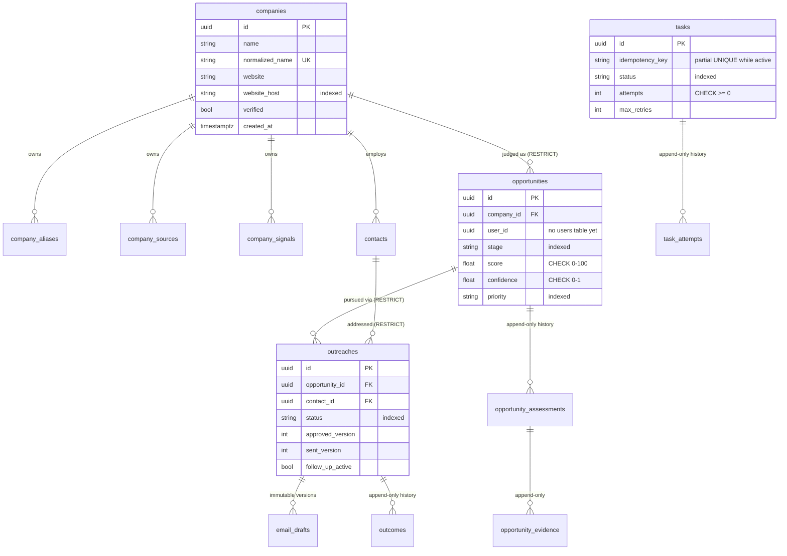

# Database

PostgreSQL 16 · SQLAlchemy 2.x (async, asyncpg) · Alembic migrations.
Persistence is strictly separated from the domain (ADR-0017): ORM models
never leave `app/database/`; repositories speak domain aggregates.

## Layout

```
app/database/
├── base.py          # DeclarativeBase
├── session.py       # engine / session factories (created in app lifespan)
├── models/          # ORM models, one module per aggregate — persistence-only
├── mappers/         # explicit domain ↔ ORM mapping, one mapper per aggregate
├── repositories/    # SQLAlchemy implementations of app/domain/repositories.py
├── uow.py           # lightweight async Unit of Work
├── seed/            # demo/test/init datasets
└── migrations/      # Alembic (async env; URL from app settings, not ini)
```

## ER diagram



Child tables use deterministic composite keys — aliases
`(company_id, normalized_name)`; sources/signals/assessments/outcomes
`(parent_id, position)`; evidence `(opportunity_id, assessment_position,
position)`; drafts `(outreach_id, version)`; attempts `(task_id, number)`
— so saves diff instead of duplicating history.

## Domain ↔ persistence mapping

| Aggregate (domain) | Tables | Mapper |
|---|---|---|
| `Company` | companies, company_aliases, company_sources, company_signals | `CompanyMapper` |
| `Opportunity` | opportunities, opportunity_assessments, opportunity_evidence | `OpportunityMapper` |
| `Outreach` (+ EmailDraft, Outcome) | outreaches, email_drafts, outcomes | `OutreachMapper` |
| `Task` (+ TaskAttempt) | tasks, task_attempts | `TaskMapper` |
| Contact (entity, minimal) | contacts | — (domain entity arrives with Discovery) |

Mapping rules: value objects flatten to columns (`CompanyName` → name +
normalized_name; `WebsiteUrl` → website + website_host); append-only
history VOs become child rows; JSONB only for audit-display blobs
(assessment reasons, evidence source provenance); pending domain events
are **never** persisted or restored — a loaded aggregate starts with an
empty event buffer.

## Transaction boundary

One application use case = one `SqlAlchemyUnitOfWork` = one
`AsyncSession` = one transaction:

```python
async with SqlAlchemyUnitOfWork(session_factory) as uow:
    company = await uow.companies.get_by_id(company_id)
    company.add_signal("volume growing")
    await uow.companies.save(company)
    await uow.commit()          # leaving without commit rolls back
```

Repositories never commit; the use case decides. Domain event publishing
will hook into the UoW after commit in a later lesson.

## Repository responsibility rules

- Accept and return **domain aggregates** — ORM models never cross the
  boundary (enforced by `tests/database/test_boundaries.py`).
- Aggregate-oriented operations only: `get_by_id` / `add` / `save` /
  `exists` + named business lookups (`find_by_normalized_name`,
  `active_keys`, `list_for_opportunity`, …). No generic CRUD base.
- One `AsyncSession` injected per Unit of Work; repositories hold no
  state of their own.

## Constraints duplicating domain invariants (defense in depth)

| Constraint | Mirrors domain rule |
|---|---|
| CHECK score 0–100, confidence 0–1 (opportunities + assessments) | value object ranges |
| CHECK data_completeness 0–1, qualification_decision controlled values | L9 scoring value objects |
| UNIQUE (opportunity_id, assessment_fingerprint) | no duplicate judgment ever inserted (replay/concurrency backstop) |
| NOT NULL assessment_fingerprint, policy_version | every judgment is identified and versioned |
| Partial UNIQUE `tasks.idempotency_key WHERE status IN ('created','running')` | one active task per key |
| UNIQUE `companies.normalized_name` | one canonical company per identity |
| FK CASCADE inside aggregates, RESTRICT across | aggregate ownership vs id-only references |

`opportunity_assessments.score_breakdown` is JSONB by design: it is an
**immutable audit snapshot** of the dimensional decomposition, never a
high-frequency relational query entry point — the searchable core
fields (score, confidence, completeness, decision, versions,
fingerprint) remain real columns.

## Commands

```bash
cd apps/backend
uv run alembic revision --autogenerate -m "describe change"
uv run alembic upgrade head
# or from repo root: make revision m="..." && make migrate
```

## Testing

- Mapper round-trips: unit tests, no database.
- Repository integration: real PostgreSQL (`importer_hunter_test`,
  created + migrated by the test session; savepoint isolation per test;
  skips cleanly when Postgres is down).
- Migration lifecycle: empty → upgrade → downgrade → upgrade on a
  scratch database.
