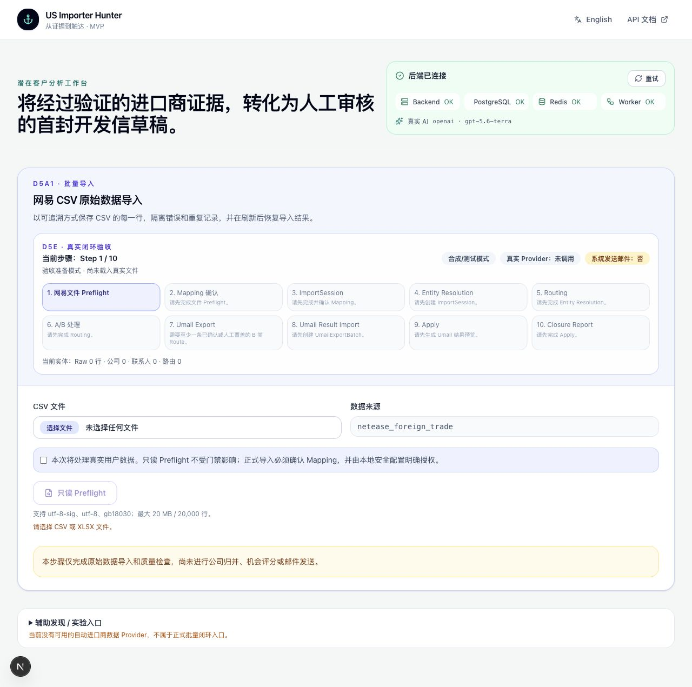
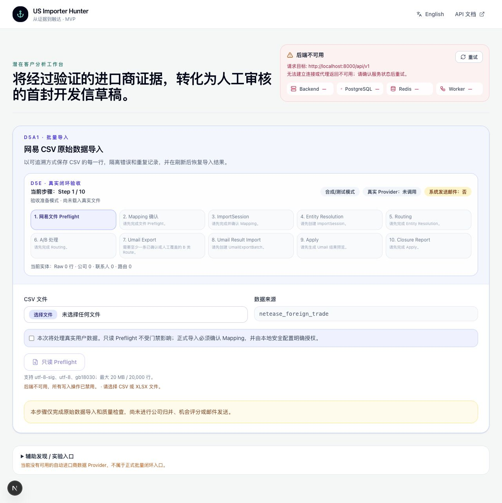
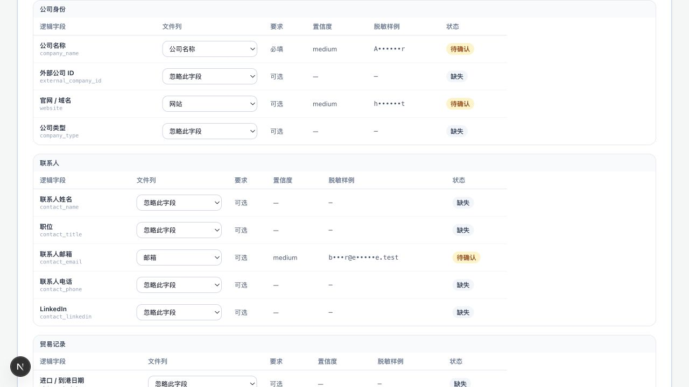
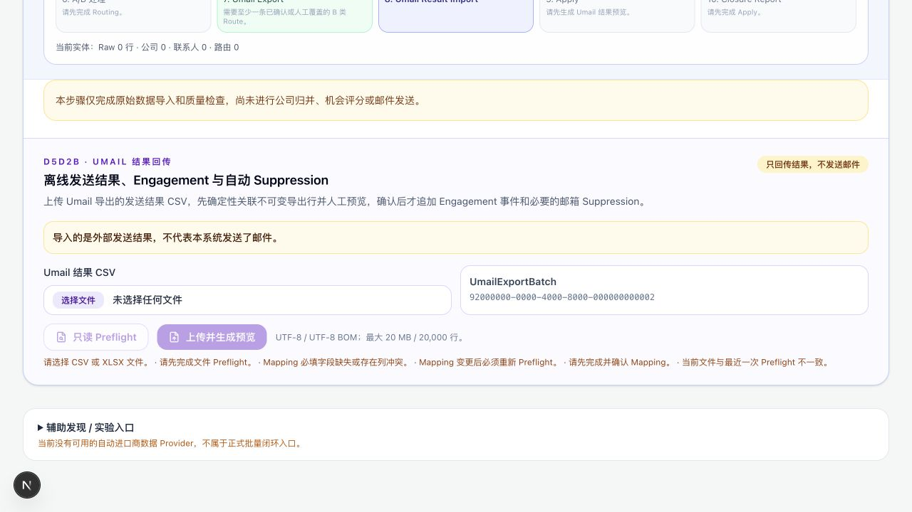

# D5e1.1 前端运行修复与验收工作区收敛报告

日期：2026-08-04

分支：`fix/acceptance-workspace-runtime-ux`

基线：`96b21bd26ff6faa2e01457da9ddd548f883e58d1`

## 1. 根因

“无法获取后端运行状态”的主要根因不是健康接口本身失效，而是生产代理配置的生命周期错误：旧实现通过 `next.config.ts` 的 rewrite 读取 `BACKEND_INTERNAL_URL`，该配置在 `next build` 时固化；Zeabur/standalone 容器只在运行期注入私网 Backend 地址时，构建产物中没有可用 rewrite，浏览器请求无法到达私网 Backend。

同时，旧前端只请求 runtime 元数据，没有把 Backend、PostgreSQL、Redis、Worker 分开检查，也没有请求超时、轮询恢复和可操作重试，因此代理或依赖异常只能表现为远离操作区的通用错误。

## 2. 修复内容

- 新增运行期 Next Route Handler：`/api/v1/[...path]` 在每次请求时读取 `BACKEND_INTERNAL_URL`，不再依赖构建期 rewrite。
- 代理采用明确 allow-list，只转发当前 MVP 使用的 API 前缀；仅转发必要请求/响应头，15 秒超时，异常返回脱敏 503。
- 前端健康卡依次检查 liveness、readiness、runtime，并显示 Backend、PostgreSQL、Redis、Worker；8 秒请求超时、5 秒轮询、人工重试、自动恢复。
- Backend readiness 增加 Redis TTL Worker heartbeat；依赖错误只返回简化原因，不返回驱动异常、凭据或连接信息。
- runtime 仅暴露 `real_data_gate=enabled|blocked`，不暴露配置值。
- 正式 NetEase/Umail 写入增加预期文件 SHA-256 校验，避免 Preflight 后替换文件。

## 3. 运行架构

### 本地开发

`Browser → NEXT_PUBLIC_API_BASE_URL（默认 localhost:8000）→ FastAPI`

### 生产/Zeabur 拓扑

`Browser → Frontend 同源 /api/v1/* → Next Route Handler → BACKEND_INTERNAL_URL → FastAPI → PostgreSQL/Redis`

`BACKEND_INTERNAL_URL` 只存在于服务端运行环境，不进入浏览器 bundle。以空 `NEXT_PUBLIC_API_BASE_URL` 构建后，生产页面、`health/ready`、`health/runtime` 均通过 `localhost:3100/api/v1/*` 验证为 200。

## 4. 页面信息架构调整

默认业务页面收敛为 10 步真实闭环验收：

1. 网易文件 Preflight
2. Mapping 确认
3. ImportSession
4. Entity Resolution
5. Routing
6. A/B 处理
7. Umail Export
8. Umail Result Import
9. Apply
10. Closure Report

默认只展开 Step 1；已解锁步骤可切换，未满足前置条件的步骤禁用并显示原因。URL 保存 `step` 以及 session/run/batch/result ID，刷新可恢复当前步骤。显式 D1 task/batch 深链会展开辅助入口，普通首页仍保持折叠。

## 5. 移除或隐藏的旧入口

- D1 一句话发现移入“辅助发现 / 实验入口”，明确显示当前没有可用自动进口商数据 Provider，不再与 NetEase 正式导入争夺首屏主操作。
- 旧单公司 Research/分析/高级表单仅在同时存在 `company_id + routing_run_id` 的 A Route 上下文展示。
- D1 实验批次的 Evidence Review 仍可单独打开，但只展示审核卡，不恢复旧高级表单或单公司分析区。
- Umail Result 仅在 Step 8/9 展示，并持续显示“只回传结果，不发送邮件”。

## 6. Mapping UI

NetEase 与 Umail 共用结构化 Mapping 编辑器：

- 按业务域分组展示逻辑字段、文件列、必填/可选、置信度、脱敏样例和匹配状态。
- 支持下拉选择文件列以及“忽略此字段”。
- 状态覆盖已匹配、待确认、缺失和冲突。
- NetEase 分组：公司身份、联系人、贸易记录、地址和地区、产品和 HS Code、其他字段。
- Umail 分组：强关联 ID、邮箱和 Campaign、事件类型、发生时间、Bounce 信息、其他结果字段。
- 高级 JSON 默认折叠；表格和 JSON 共用内部状态；无效 JSON 不覆盖最后一次有效 Mapping，修改后必须重新 Preflight。
- 样例值由后端统一脱敏，报告和截图不含完整邮箱、电话或真实公司列表。

## 7. 门禁矩阵

| 操作 | 必要条件 | 失败行为 |
| --- | --- | --- |
| NetEase Preflight | Backend 健康；CSV/XLSX 已选择 | 禁用并显示具体原因；无业务写入 |
| NetEase 正式导入 | Backend/PostgreSQL 健康；Preflight 完成；必填 Mapping 完整且确认；用户真实数据确认；本地 `real_data_acknowledged` 启用；文件 hash 未变化 | 前后端双重拒绝，不创建 ImportSession |
| Umail Result Preflight | Backend/PostgreSQL 健康；文件已选择；UmailExportBatch 存在 | 只读失败，不创建 Result Import |
| Umail 上传预览 | Preflight 完成；Mapping 完整且确认；真实数据门禁满足；文件 hash 未变化 | 拒绝写入，不生成 Preview |
| Apply | Preview 存在；审核完成；`confirmed=true`；本地真实数据门禁启用；Preview/hash 未过期 | 拒绝 Apply，不追加 Engagement/Suppression |
| Backend 不可用 | — | 所有写操作禁用；文件说明仍可读；不进入假成功状态 |

## 8. 私有文件保护

- 仓库级 `.gitignore` 精确规则：`.local/acceptance/*`。
- 唯一例外：`!.local/acceptance/README.txt`，安全说明可随 clone 恢复。
- `git check-ignore -v .local/acceptance/sample.csv` 命中仓库级规则。
- `.git/info/exclude` 不再承载 acceptance 目录规则。
- README 明确：真实文件不进 Git、不复制到 fixture、不写普通日志、原文件不可修改、Preflight 只读而 Apply 可能受控写入。

## 9. 测试

| 门禁 | 结果 |
| --- | --- |
| Backend 全量 pytest | `1208 passed in 154.49s` |
| Backend Ruff | 通过 |
| Backend strict mypy | 通过，425 source files |
| Alembic 当前库 | `d5d2b1c2d3e4 (head)`；单一 head；`alembic check` 通过 |
| 临时 PostgreSQL Migration | upgrade → downgrade -1 → upgrade 通过；临时库已删除 |
| PostgreSQL integration | 已包含在全量 pytest，全部通过 |
| Frontend TypeScript | `tsc --noEmit` 通过 |
| Frontend ESLint | 0 error；5 个既有 warning |
| Production build | 空 `NEXT_PUBLIC_API_BASE_URL` 构建通过；动态 `/api/v1/[...path]` 存在 |
| Production same-origin Playwright | 3/3 通过 |
| D5e1.1 定向 Playwright | 25/25 通过，41.5 秒 |
| Docker/HTTP | Backend、PostgreSQL、Redis、Worker 健康；health/ready/runtime/frontend 均 200 |

未运行重复长时间性能测试；本轮没有性能路径或数据模型变化。

## 10. 截图

以下均为合成/测试模式界面，不是 D5e2 真实文件验收结果。

### Backend 正常、Step 1

### Backend 不可用与可操作错误

### 自动结构化 Mapping

### Umail Result Step 8

## 11. 未处理技术债

1. API proxy allow-list 仍需在新增正式 API 前人工更新；本轮不引入自动路由注册，避免扩大攻击面。
2. Worker heartbeat 证明进程存活，不代表任务吞吐或队列延迟健康；高级 observability 不属于当前 MVP。
3. 健康轮询使用固定 5 秒间隔，尚无指数退避或页面可见性优化；当前请求量极低。
4. `bulk-import-panel.tsx` 仍较大；本轮按要求复用组件，没有做全站重构。
5. Frontend 仍有 5 个既有未使用变量 warning，均位于未改动的 `candidate-cards.tsx`，不影响构建。
6. 四张截图仅证明运行和交互状态，不证明真实 NetEase 数据质量；真实结论必须等待 D5e2 文件。

## 12. 是否可接收真实网易文件

结论：可以进入 D5e2 的只读 Preflight。

当前系统已具备私有目录、CSV/XLSX 选择、结构化 Mapping、脱敏样例、文件 hash、无副作用 Preflight、数据库/Worker 健康状态和正式写入双重门禁。尚未收到或使用真实 NetEase 文件，因此不能宣称真实格式、覆盖率或归并质量已经验收。正式导入仍必须等待用户确认 Mapping、勾选真实数据确认并在本地安全配置中显式启用门禁。

## 13. PR 状态

- 分支：`fix/acceptance-workspace-runtime-ux`
- Commit message：`fix(frontend): stabilize acceptance runtime and simplify workflow`
- PR 标题：`fix(frontend): repair acceptance runtime and remove duplicate workflows`
- 状态：本报告与实现进入同一提交；推送后创建 OPEN PR，不合并。
- PR #4 Calibration：未修改、未合并。
- 无 Migration、无核心业务模型、无 release tag。
- 未调用真实 LLM、外部 Provider 或 Umail API；未发送邮件。
