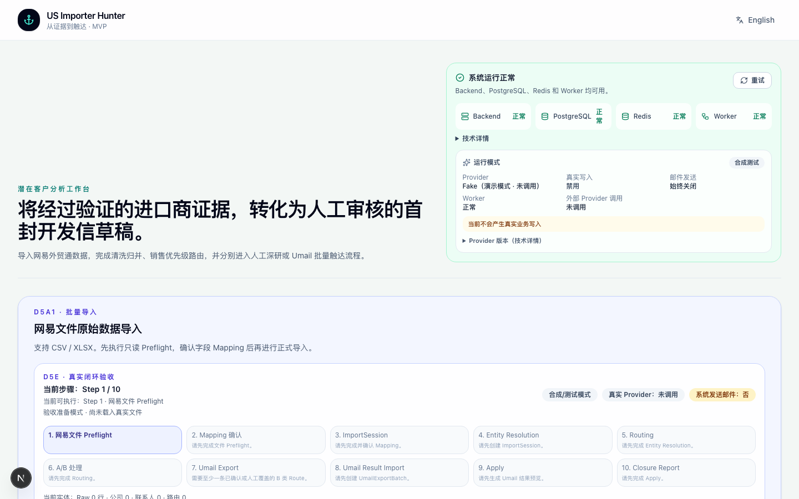
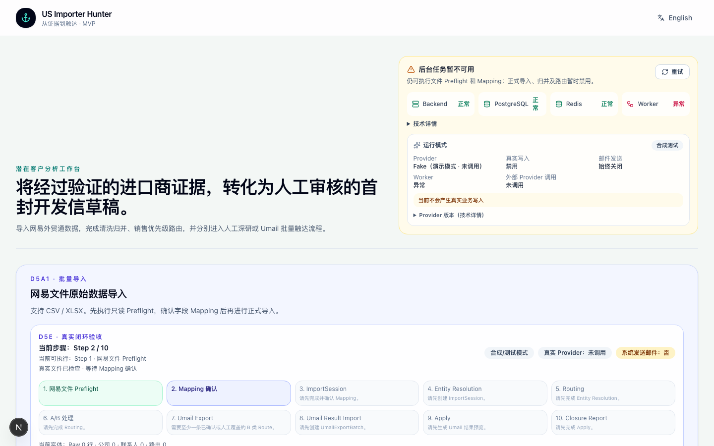
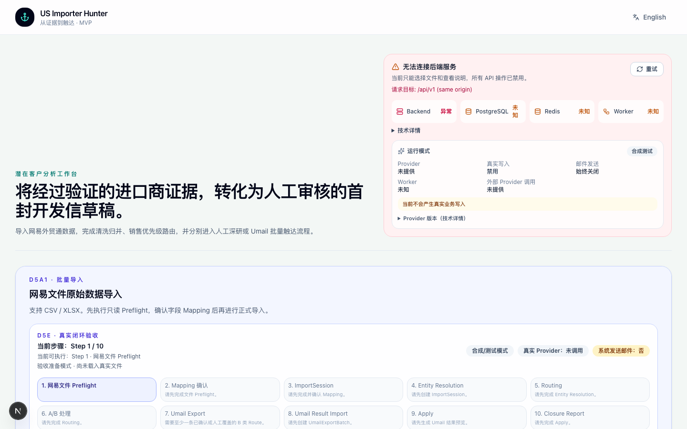
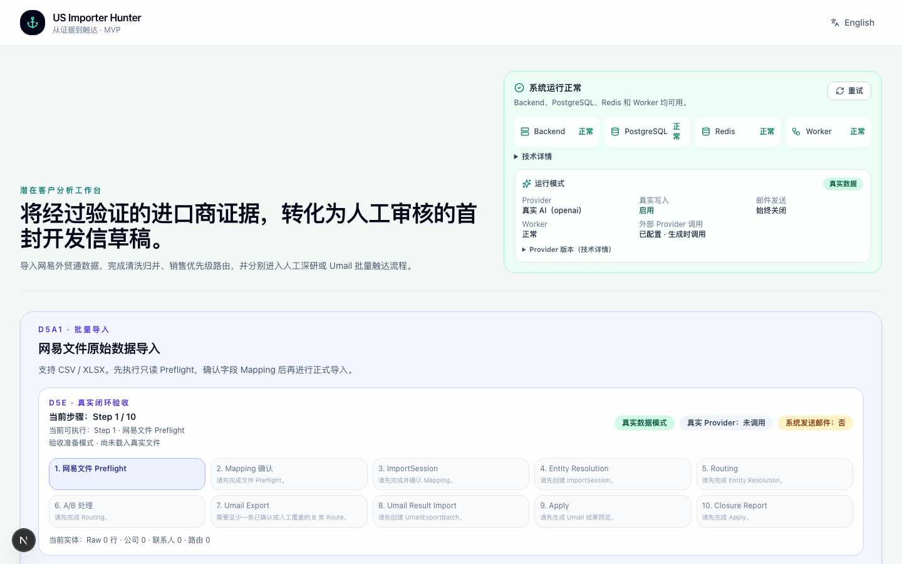
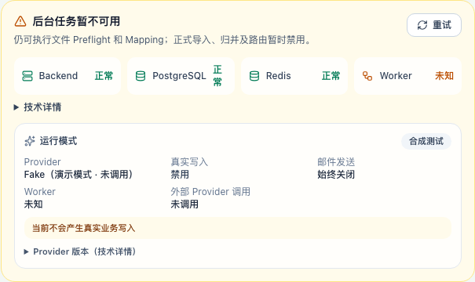

# D5e1.2 Runtime Worker Health 与 Acceptance UX 修复报告

日期：2026-08-06

分支：`fix/runtime-worker-health-and-acceptance-ux`

基线：`main @ 646856a`

## 1. 根因

“Worker：—” 不是心跳代码失效，而是 **Worker 进程没有运行**：heartbeat 只在
worker 主循环中写入，进程不存在时 Redis TTL（15 秒）自然过期，readiness 正确地把
Worker 报告为不可用。宿主开发模式（README/Makefile 的 `make infra && make backend
&& make frontend`）**根本没有 Worker 启动入口**；Docker 只起部分服务时同样不会带
worker。这是用户看到该状态的真实链路。

次要根因（本轮一并修复）：

1. readiness 只能区分“key 存在/不存在”，无法区分 missing、expired、invalid，
   统一返回 `worker heartbeat missing or expired`；
2. heartbeat payload 只是裸 owner 字符串，没有时间戳，无法计算 last_seen / age；
3. heartbeat 只在 job 循环顶部刷新，长任务（例如官网 Research 最长 45 秒）期间
   TTL 会过期，造成“活着但显示不可用”的假阴性；
4. 前端把所有非 healthy 依赖统一渲染成 “—”，并把所有降级状态折叠成一句
   “后端已连接，但部分组件不可用”，没有原因、没有可操作提示；
5. 门禁是全局布尔，Worker 不可用时没有按能力区分哪些仍可用（Preflight/Mapping）。

## 2. Worker 启动与 heartbeat 链路

- Compose：`worker` 服务命令 `uv run python -m app.worker`，与 Backend 使用同一
  Redis（dev 为 DB 0，E2E 隔离栈为 DB 1），工作目录 `/app`，Python path 正确。
- 启动后立即写入第一次 heartbeat，之后由独立心跳任务每 5 秒刷新（与 job 执行长度
  解耦），TTL 15 秒；graceful shutdown 时删除 key，使状态立即变为不可用。
- 修复前心跳为裸字符串；修复后为 JSON `{"owner": ..., "heartbeat_at": <UTC ISO>}`。
- 停止 worker → TTL 过期 → readiness 报 `WORKER_HEARTBEAT_MISSING`；重启 worker →
  8 秒内恢复 `WORKER_HEARTBEAT_OK`（已在 Compose 实测复现与自愈）。
- 旧格式 payload 会被新解析器识别为 `WORKER_HEARTBEAT_INVALID`，不会伪装成功。

## 3. Redis / heartbeat 契约

- key：`us_importer_hunter:worker:heartbeat`
- TTL：15 秒；刷新间隔：5 秒（`WORKER_HEARTBEAT_REFRESH_SECONDS`）
- payload：`{"owner": "<host>:<pid>:<uuid8>", "heartbeat_at": "<UTC ISO>"}`
- 契约代码：`apps/backend/app/core/worker_health.py`
- 不暴露：Redis URL、密码、内部 hostname（owner 只进 Redis，不进 API 响应）。

## 4. API 状态模型

`GET /api/v1/health/ready` 的 worker 依赖新增结构化字段（postgres/redis 保持 v0.1
原样，向后兼容）：

```json
{
  "name": "worker",
  "healthy": true,
  "detail": null,
  "status": "healthy|unavailable|unknown",
  "reason_code": "WORKER_HEARTBEAT_OK|WORKER_HEARTBEAT_MISSING|WORKER_HEARTBEAT_EXPIRED|WORKER_HEARTBEAT_INVALID|REDIS_UNAVAILABLE",
  "last_seen_at": "<timestamp|null>",
  "age_seconds": 0.4
}
```

状态语义：missing=无 key；expired=key 存在但时间戳超过 TTL；invalid=payload 无法
解析；unknown=Redis 不可用无法判定。API 从不返回 Redis key、URL、凭据或原始异常。

## 5. 前端 capability matrix

不再用全局 healthy 开关，按能力门禁：

| 能力 | 依赖 | Worker 不可用时的行为 |
| --- | --- | --- |
| 文件选择 / 本地说明 | 无 | 始终可用 |
| NetEase Preflight（只读） | Backend | 可用（不依赖 Worker） |
| Mapping 确认 | 成功 Preflight | 可用 |
| 正式 ImportSession | Backend + PostgreSQL + Worker + 真实数据门禁 + 文件 hash + Mapping 确认 | 禁用并显示“后台 Worker 不可用” |
| Entity Resolution / Routing / A-B 处理 | Backend + PostgreSQL + Worker | 按钮禁用并显示具体原因 |
| Umail Result Preflight（只读） | Backend + PostgreSQL | 可用，不因 Worker 阻断 |
| Umail 导出 / Apply | Backend + PostgreSQL + Preview/确认门禁（同步 API） | 不新增 Worker 依赖 |
| 写操作通用 | 依赖状态已确认（非 stale） | stale 时禁用直至重新确认 |

## 6–9. 截图（测试数据，无真实公司/邮箱/文件）

### 全部健康 + 合成测试模式



### Worker 不可用但 Preflight 可用



### Backend 不可用



### 真实数据模式（Provider Real）



### Worker 未知（显示“未知”，不再是 “—”）



## 10. 测试结果

| 门禁 | 结果 |
| --- | --- |
| Backend 定向 pytest（health 契约） | 11 passed |
| Backend 全量 pytest（含 PostgreSQL 集成） | 1214 passed，96.5s |
| Backend Ruff 全量 | 通过 |
| Backend strict mypy（app + tests） | 通过，425 source files |
| Frontend TypeScript | `tsc --noEmit` 通过 |
| Frontend ESLint | 0 error（5 个既有 warning 未新增） |
| Frontend production build | 通过 |
| 定向 Playwright（健康卡/能力矩阵/provider/批量导入） | 16 passed（含修复 redis-unknown 用例后复跑） |
| 全量 E2E（排除 @real） | 35 passed，**56 failed（既有失败，见 §13）** |

## 11. Docker smoke

- Compose dev 栈（backend/frontend/postgres/redis/worker）全部 healthy；
- `GET /api/v1/health`、`/health/ready`、`/health/runtime` 均 200；
- Redis 中 heartbeat key 存在且 TTL 持续刷新；
- 停止 worker → readiness `WORKER_HEARTBEAT_MISSING` → 重启 → 8 秒内
  `WORKER_HEARTBEAT_OK`（自愈）；
- production standalone 前端镜像 + `BACKEND_INTERNAL_URL=http://backend:8000`：
  `:3002` 页面 200，同源 `/api/v1/health` 代理 200（未配置时 fail closed 的既有
  行为未回归）。

## 12. Git 状态

- 独立修复分支 `fix/runtime-worker-health-and-acceptance-ux`，基于最新 main；
- PR #4（Calibration）保持 OPEN，未修改、未合并；
- 工作树仅包含本轮实现与报告文件；
- 提交/推送/PR 状态见文末。

## 13. 已知技术债

1. **56 个既有 E2E 失败（与本轮无关）**：`review-path`、`guided-flow`、
   `research-panel`、`trial-findings`、`i18n`、`evidence-to-draft`、
   `department-contact-draft`、`qualified-path`、`discovery-task` 等用例在普通 `/`
   页通过 `fillProspectForm` 打开高级表单，而 D5e1.1（merge `646856a`）已把高级
   表单收敛到 A-Route 上下文。`git diff` 证明本轮未触碰该可见性逻辑；这些用例需在
   后续单独任务中按新入口改写，不属于 Runtime Health 范围。
2. heartbeat 证明进程存活，不代表队列吞吐/延迟健康；高级 observability 属于
   MVP 之外（ADR-0013 继续成立）。
3. graceful shutdown 删除 heartbeat key 基于单 worker 假设；多副本部署需要
   owner-scoped key，本轮不引入。
4. TTL / 刷新间隔是代码常量而非配置项；MVP 阶段保持最小，未加 settings。
5. 宿主开发模式新增 `make worker` 目标，但宿主运维（进程守护、自启）仍由用户负责。
6. API proxy allow-list 仍为手工维护；自动路由注册会扩大攻击面，保持现状
   （ADR-0026），新增正式 API 时需人工评审。
7. 健康轮询固定 5 秒，无指数退避；当前请求量极低，未引入可见性优化。

## 14–17. 合规确认

- **Migration**：未修改，未新增；Alembic 单 head `d5d2b1c2d3e4` 不变。
- **外部服务**：未调用任何真实 LLM、ImportYeti、Umail API 或外部网络；仅本地
  health 探测与 E2E 隔离栈（fake provider）。
- **真实写入**：未产生；仅 E2E 隔离数据库（`importer_hunter_e2e`，fake 数据）。
- **邮件发送**：始终关闭，未发送任何邮件。

## 技术选择说明

- **为什么用 Redis TTL heartbeat**：进程级存活性证明不需要数据库写入；TTL 自然
  过期覆盖崩溃场景；JSON 时间戳 payload 使 missing/expired/invalid 可区分；独立
  心跳任务解决“长 job 期间假不可用”。
- **为什么 Preflight 不依赖 Worker**：Preflight 是 API 同步执行的只读文件检查，
  Worker 只执行排队的归并/路由/批量任务；耦合会无谓阻断只读验收。
- **为什么用 capability-based gating 而非全局 healthy 开关**：不同步骤依赖不同
  组件，全局开关会在仅 Worker 异常时错误禁用 Preflight/Mapping。
- **为什么保留手工 proxy allow-list**：避免把内部验收/研究接口自动暴露到浏览器
  公网面（ADR-0026）；新 API 需要人工评审后加入。

## 交付

- 建议 Commit message：`fix(runtime): repair worker health and capability gating`
- 建议 PR 标题：`fix(runtime): restore worker health and clarify acceptance capabilities`
- 已 Commit、已 Push、已创建 PR（不合并，等待 review）。
