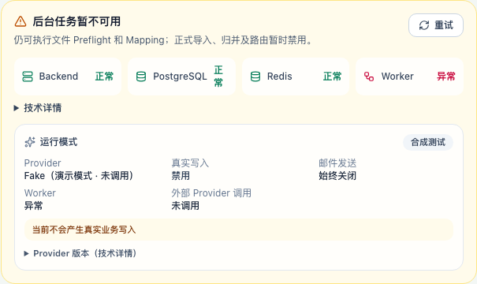
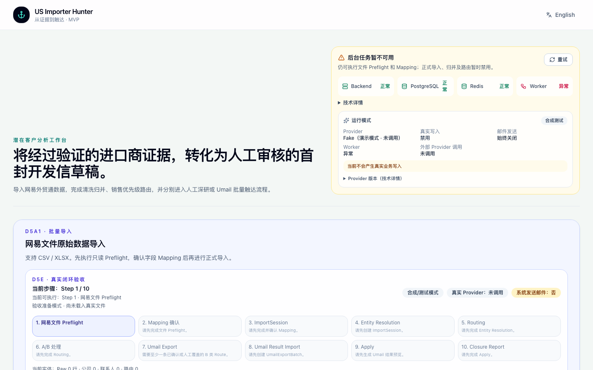
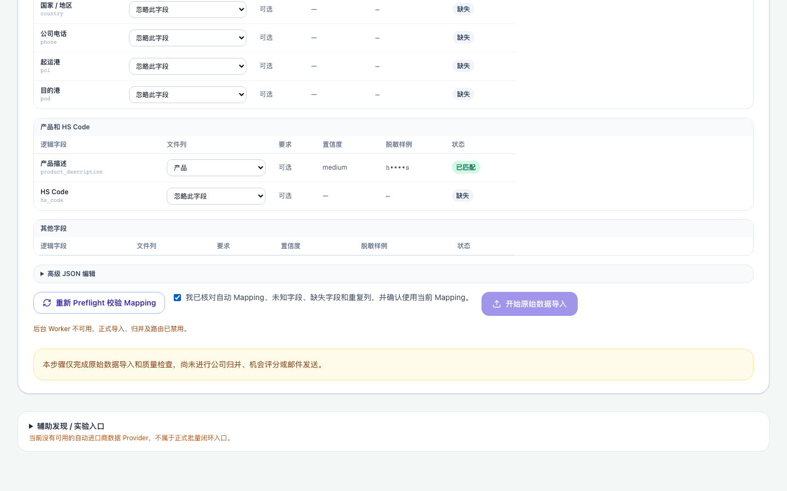
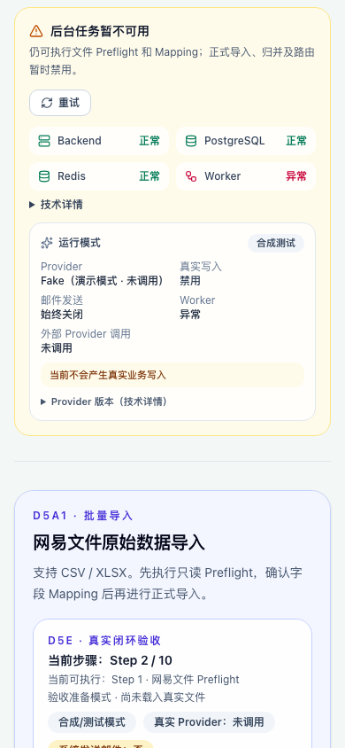

# D5e1.3 GitHub Merge 与 Zeabur 部署报告

日期：2026-08-06

## 1. PR #13 最终状态

- PR #13 `fix(runtime): restore worker health and clarify acceptance capabilities`
  OPEN → **已 Squash Merge**。
- 合并前审计通过：`MERGEABLE`、`mergeStateStatus=CLEAN`、GitHub check
  `d5a1`（PR quality gate）SUCCESS；PR #4 Calibration 保持 OPEN、head 未变。
- 审计扫描：diff 内无 `/private/tmp`、`/tmp`、`.local`、`.env`、dump/sql/csv/
  xlsx、密钥、Redis URL、数据库密码或本地绝对路径；报告截图均为正式测试截图。
- Alembic 单 head `d5d2b1c2d3e4`，无新增/修改 Migration。

## 2. Squash merge commit

`b3315f8bd97c85ea2b35cc87bdc669c0d668c4cf`

`fix(runtime): repair worker health and capability gating`

## 3. main / origin/main 一致性

合并后本地 `git checkout main` + `git pull --ff-only`：

- `git rev-parse HEAD` == `git rev-parse origin/main` == `b3315f8`
- 工作树干净（E2E 运行重新生成的 artifacts 截图已恢复）。

## 4. 全量 E2E 基线对比

同一套命令（`npx playwright test --grep-invert @real`，隔离栈、全新数据库）：

| 运行 | 收集 | passed | failed |
| --- | --- | --- | --- |
| origin/main（646856a） | 81 | 27 | 54 |
| PR #13 head（b3315f8，含修复） | 91 | 37 | 54 |

- 失败集合**逐条一致**：PR head 的 54 个失败与 main 的 54 个失败完全相同
  （0 新增、0 消失）；PR 新增的 10 个 runtime-health 用例全部通过。
- 失败类型：41 个 `locator.fill`/`click` Timeout（普通 `/` 页找不到高级表单）、
  13 个 expect 断言失败（同因：旧入口已收敛）。
- 中间验证：首轮 PR head 运行曾多出 1 个新失败（`validation-readiness`「the
  notice is localized」，英文文案大小写），已修复并重跑确认；另有一次在未清空
  E2E 数据库的重跑中 bulk-import 出现归并计数失败，确认为**残留数据污染**而非
  代码回归（全新数据库重跑通过）。
- 结论：满足合并条件——PR #13 没有新增 E2E 失败；失败集合与 main 基线一致；
  失败原因均为旧测试仍使用普通首页高级表单入口。

### 54 个既有失败清单（main 与 PR head 一致）

#### department-contact-draft.spec.ts（1）
- 部门邮箱直达部门级草稿并可刷新恢复

#### discovery-task.spec.ts（2）
- automatic discovery fails closed with the required Chinese guidance
- one-sentence manual CSV discovery survives a page refresh

#### evidence-to-draft.spec.ts（1）
- 研究 → CSV 证据 → 资格更新 → Draft → Reload

#### guided-flow.spec.ts（15）
- DISQUALIFIED never produces a draft
- REVIEW never produces a draft and says what is missing
- a failed draft keeps the research and the qualification
- a missing contact shows the gap but never blocks the analysis
- a qualified result produces a draft automatically
- confirming runs qualification without a second button
- four steps are always visible and advance with the flow
- no email is ever sent
- switching to English sends en-US for the next run
- the analysis carries the researched sources and signals
- the manual form is collapsed but still usable
- the prompt does not vanish while the user is still typing
- the research summary appears above the claims
- the run request carries the UI language
- the sender is remembered, so the next company only asks for a contact

#### i18n.spec.ts（2）
- defaults to Chinese, switches to English, and survives reload
- signal-kind dropdown shows localized labels and submits English enums

#### qualified-path.spec.ts（1）
- company → Chinese signals → QUALIFIED → decision maker → draft → approve → reload

#### research-panel.spec.ts（16）
- accept, edit and reject are sent as one batch
- budget_exceeded is explained
- claims start pending — nothing is accepted for the reviewer
- completed run shows pages, claims and evidence
- confirmed research fills the advanced form and asks only for what is missing
- filled fields remain editable
- is visible only when the feature flag is on
- needs_browser is explained, not silently empty
- no credentials, endpoints or raw HTML reach the page
- panel is fully localized and switches with the rest of the UI
- partial run reports failed pages
- robots_denied is explained
- unknown dimensions are shown as open questions, not weaknesses
- unknown dimensions section is absent when the list is empty
- unknown dimensions survive a reload of the saved run
- unknown-dimension copy is localized in English too

#### review-path.spec.ts（1）
- thin evidence → REVIEW, no draft, explainable reasons shown

#### trial-findings.spec.ts（15）
- a legacy payload that still repeats a name cannot crash the page
- an edit made this session is not reverted by the saved profile
- clearing removes it from the browser
- collapsing the advanced editor does not lose it
- comes back after a reload
- distinct sources are all shown
- is reused for the next company
- is written as the user types
- one site seen twice renders once, with a count
- recommends import evidence without calling it qualified
- says the gap is the source, not the company
- separates obtained evidence from what is still missing
- starts empty
- the contact is never stored as a global profile
- the explanation is localized

## 5. E2E 技术债 Issue

- Issue #14：`test(e2e): align legacy flows with D5 workspace entry points`
  （含失败清单、旧/新入口差异、迁移方案、验收标准：全量非 @real E2E 恢复绿色）。

## 6. Zeabur 服务与部署 commit

项目 `us-importer-hunter`（环境 production，ID 脱敏），服务：

| 服务 | 部署 commit | 状态 |
| --- | --- | --- |
| frontend | b3315f8 | RUNNING |
| backend | b3315f8 | RUNNING |
| worker | b3315f8 | CRASHED → REMOVED（见 §7/§16） |
| postgresql | 原实例 | 保留，未重建/未清空 |
| redis | 原实例 | 保留，未重建/未清空 |

Zeabur 对 Git 链接服务在 main push 后自动部署到同一 commit；Backend/Frontend
已自动切到 b3315f8，Worker 自动部署后因数据库问题无法启动。

## 7. Backend / Worker / Frontend 部署状态

- Backend：b3315f8 RUNNING；`/api/v1/health` 200、ready 200、runtime 200。
- Worker：b3315f8 自动部署后启动即崩溃：
  `sqlalchemy.exc.ProgrammingError: relation "import_processing_jobs" does not exist`。
- Frontend：b3315f8 RUNNING（新 UI 已上线）。

## 8. PostgreSQL / Redis 是否保持原实例

是。PostgreSQL 与 Redis 均为原实例，未重建、未清空、未写入业务数据；仅执行了
只读 `alembic current` / `alembic heads` 与 schema 检查。

## 9. Health / Ready / Runtime 响应摘要（production）

```json
GET /api/v1/health        → {"status":"ok","app":"us-importer-hunter","environment":"production"}
GET /api/v1/health/ready  → {"status":"degraded","dependencies":[
  {"name":"postgres","healthy":true,"detail":null},
  {"name":"redis","healthy":true,"detail":null},
  {"name":"worker","healthy":false,"detail":"worker heartbeat missing",
   "status":"unavailable","reason_code":"WORKER_HEARTBEAT_MISSING",
   "last_seen_at":null,"age_seconds":null}]}
GET /api/v1/health/runtime→ provider=fake · research_provider=deepseek ·
                            environment=production · real_data_gate=blocked
```

## 10. Worker heartbeat 连续观察结果

未完成：Worker 启动即崩溃（生产库缺表），heartbeat 从未写入；
`WORKER_HEARTBEAT_MISSING` 稳定且符合预期。20 秒 TTL 连续观察无法执行，
属于部署阻塞项（§16），不伪造通过。

## 11–12. 前端运行状态与 capability gating 截图

线上新 UI（b3315f8）已部署并通过 16/16 只读 smoke；以下截图均为合成测试数据，
不包含环境变量、API Key、数据库/Redis URL、内部域名、真实文件或公司/邮箱数据。









Smoke 结论（线上）：

- 健康卡正确显示“后台任务暂不可用”，Worker 状态“异常”，无 “—”；
- 运行模式区独立展示：Provider Fake（演示模式）、真实写入禁用、邮件发送始终
  关闭、Worker 异常、外部 Provider 未调用；
- 文件选择可用；只读 Preflight 用合成 CSV 成功（无业务写入）；
- 正式 Import 禁用并显示“后台 Worker 不可用，正式导入、归并及路由已禁用”；
- 刷新后状态保持；1440px 无重叠，移动端健康卡位于 Hero 下方。

## 13. 是否调用外部服务

未调用真实 LLM / ImportYeti / Umail API；只执行了 health 探测与 Zeabur CLI/
API 管理操作。Runtime 显示 research_provider=deepseek 为既有生产配置，本轮未
触发任何研究提取；email provider=fake。

## 14. 是否产生真实写入

未产生。未创建 ImportSession、未 Apply、未写入任何业务记录；仅 Zeabur 平台
自身的部署/变量管理操作与只读 Preflight（合成数据）。

## 15. 是否发送邮件

未发送。Email 生成器为 fake 且无发送代码路径。

## 16. 已知阻塞

**生产数据库落后于 Alembic head（既有问题，非本轮引入）。**

- 只读检查：`alembic current` 无版本输出；`alembic heads` = `d5d2b1c2d3e4`；
  Worker 启动查询 `import_processing_jobs` 报
  `relation "import_processing_jobs" does not exist`。
- 判定：生产库未在预期 head → 按指示**停止部署、不自动迁移**。
- 影响：Worker 无法启动 → heartbeat MISSING；Frontend/Backend 在线并进入
  capability degraded 状态（正是 D5e1.2 设计的降级行为）。
- 所需用户操作（最少步骤）：
  1. 在 Zeabur Backend 控制台终端先备份数据库；
  2. 执行一次 `uv run --no-dev alembic upgrade head`（生产 DATABASE_URL 环境内）；
  3. 重新部署 Worker 并观察 heartbeat 恢复；
  4. 恢复后再确认 Frontend 全健康（本轮 Frontend 已由自动部署先行上线）。

## 17. 回滚点

- Backend：可 `zeabur service redeploy` 回退到 646856a（当前 RUNNING，无需回滚）。
- Worker：部署前即为 CRASHED（646856a 同样崩溃），无可用前序运行态；真正修复
  依赖 §16 的数据库迁移。
- Frontend：可回退到 646856a（当前 b3315f8 RUNNING，新 UI 正常）。
- PostgreSQL / Redis：不回滚、不重建。
- 未创建正式 release tag。

## 18. 下一步真实数据验收要求（D5e2b，仅计划不执行）

部署阻塞解除（§16 迁移完成、Worker heartbeat OK）后，D5e2b 才可进入：

- 用户提供一份真实网易外贸通 CSV 或 XLSX（建议先用脱敏的 20–100 家公司样本，
  含公司、联系人和贸易记录）；
- 用户在页面确认字段 Mapping；
- 用户明确勾选真实数据模式并确认正式 Import；
- 本轮不寻找、不生成替代真实数据；未满足前保持 `D5E_WAITING_FOR_REAL_FILES`。
