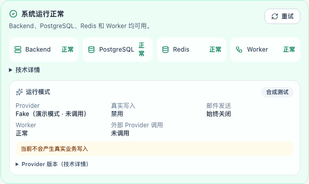
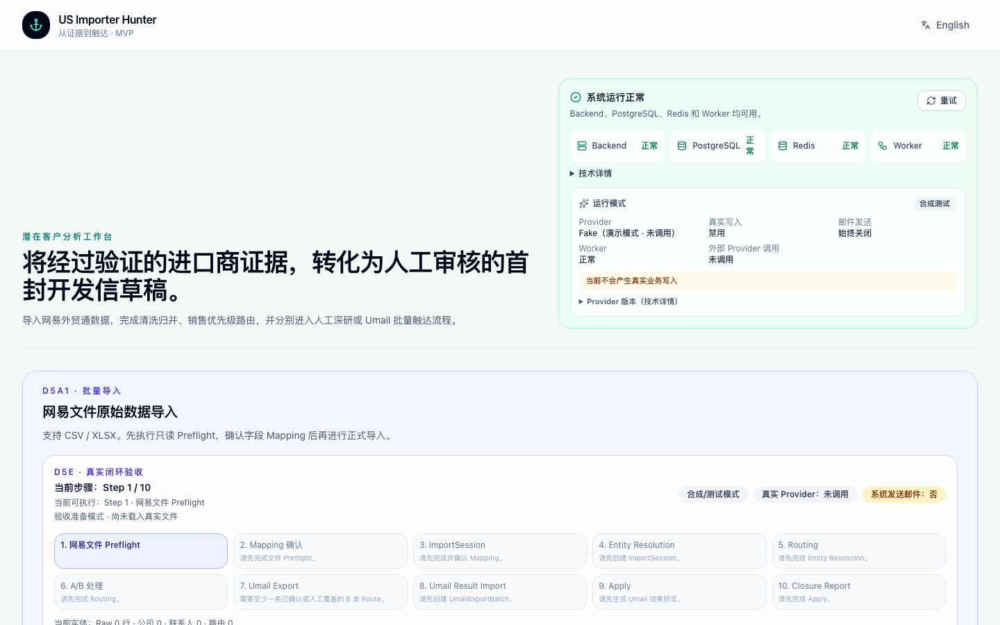
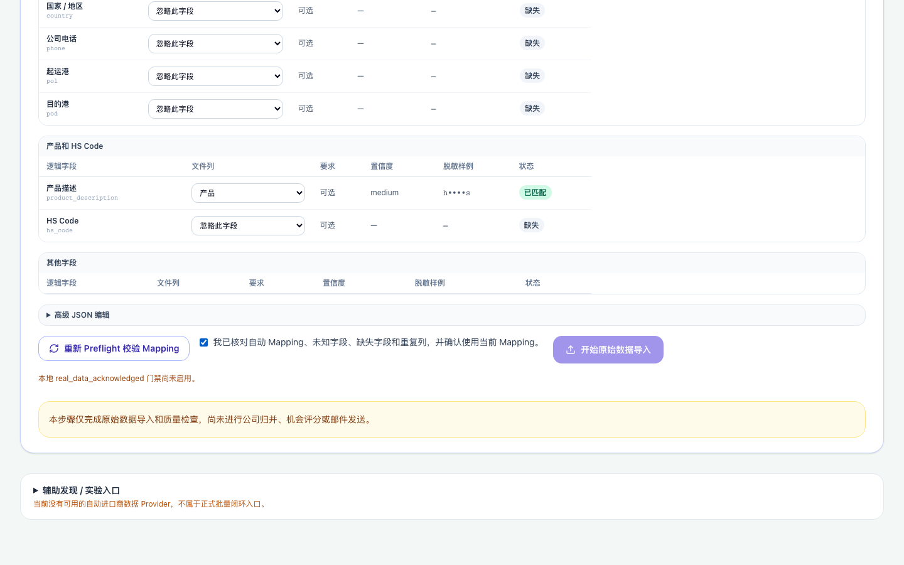
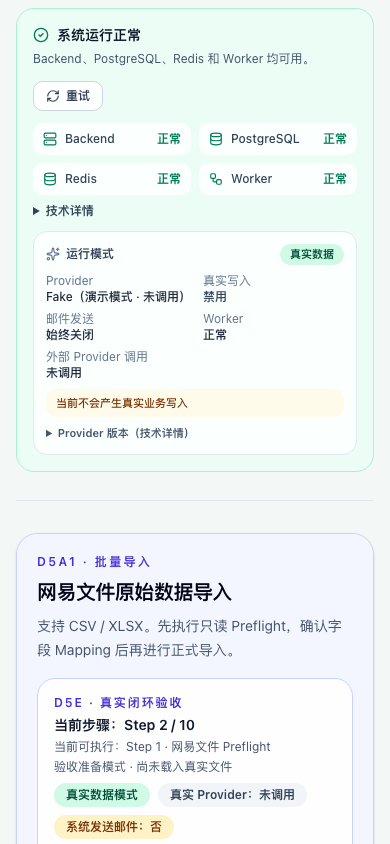

# D5e1.4 Production Schema Reconciliation & Worker Recovery 报告

日期：2026-08-06

## 1. Production backup 是否成功

成功。通过 Zeabur PostgreSQL 容器内的 `pg_dump`（PostgreSQL 18.4）对 Backend
`DATABASE_URL` 指向的生产库执行备份：

- `pg_dump -Fp`（plain SQL）：文件非 0（747 字节），头尾完整（PG18 dump 头 +
  `\restrict`/`\unrestrict` 结束标记），可读验证通过；
- `pg_dump -Fc`（custom）尝试：文件含 `PGDMP` 头，但 CLI 二进制流被截断，
  已改用 plain SQL 作为正式验证备份；
- 备份位于 `/private/tmp/uih-backup-*.sql`，**未进入 Git**；
- 全程未输出 DATABASE_URL、密码或 token。

## 2. alembic_version 初始状态

不存在。`alembic current` 无版本输出；
`to_regclass('public.alembic_version')` 返回 NULL；无版本表、无版本记录。

## 3. Production schema fingerprint

- 实例内数据库：`postgres`、`zeabur`（仅两个）；
- Backend 连接：db=`zeabur`（host/port 脱敏）；
- `public` schema 表数：**0**；
- 关键表（companies/contacts/opportunities/email_drafts/…/import_processing_jobs）
  全部不存在；
- 无任何业务行。

结论：生产库是**从未执行迁移的空库**，不是“部分迁移的历史库”。

## 4. Migration provenance 判断

判断：**A（production 明确对应 base）**。

依据：空 public schema + 无 alembic_version，与 Alembic base（首个 migration
`85d4b54db359` 之前）完全一致，不存在可归属的中间 revision。

简报中“数据库已经存在历史业务表”的前提经法证**不成立**。

## 5. Confidence

**HIGH**。空 schema 状态无歧义，不涉及任何既有对象或数据。

## 6. Identified base revision

`base`（空库）。`import_processing_jobs` 由
`d5b1e2f3a4b5_add_import_entity_resolution.py` 创建（该表不存在的原因即全库
未迁移）。

## 7. Upgrade migration 列表

base → `d5d2b1c2d3e4 (head)`，共 26 个 migration 全链（按 `alembic history`
正序）：

`85d4b54db359 → eaef5d33aa6a → 1d123ee886aa → c4470047a477 → d6ef81dfc959 →
4a91c2e8b730 → 2031082e3176 → fc77daaecd96 → ce8f83bb658b → b3d5a1c94e27 →
c7e2f4a91b83 → e51b7c3d84af → 9d9f7576a7ac → 54b3de20fb09 → 000f9f538d31 →
0d4c02e927a7 → a42c9e81f6b0 → b7f1c84a9d23 → f8c1d2e3a4b5 → d2a1b2c3d4e5 →
d2b2c3d4e5f6 → d3a3b4c5d6e7 → d5a1c2d3e4f5 → d5b1e2f3a4b5 → d5c1f2e3a4b6 →
d5d2a1b2c3d4 → d5d2b1c2d3e4`

## 8. Destructive operation 检查

- 对生产数据：无破坏性操作（生产为空库，无数据可损）；
- 迁移内 drop 仅针对中间 evidence 表（a42c9e81f6b0、b7f1c84a9d23、
  f8c1d2e3a4b5 的 drop/recreate 模式），空库下无损失；
- `op.execute` 为 backfill/guard（d2a1b2c3d4e5、d5b1e2f3a4b5、d5c1f2e3a4b6），
  0 行数据时无副作用；
- offline `--sql` 预览因 `d2a1b2c3d4e5` 使用 `sa.inspect(op.get_bind())`
  无法在 offline 模式生成完整 SQL（env 限制）；改用**临时库完整排练**替代：
  本地 scratch DB 执行 base→head 全链成功，55 张表、check 无 drift，随后删除
  排练库。

## 9. 是否执行 stamp

未执行。判定 schema == base（空库），`alembic stamp base` 与直接 upgrade
等价且无 bookkeeping 可恢复；按“stamp 仅用于恢复 Migration bookkeeping”原则
跳过，直接走标准升级路径。

## 10. 是否执行 upgrade

已执行（满足全部前置：备份已验证、provenance HIGH、排练通过、无破坏性、
PostgreSQL 可用、Backend healthy、无并发写入任务）。在 Backend 容器内运行
`uv run --no-dev alembic upgrade head`，26 个 migration 全部成功。

## 11. Migration 前后关键表计数

迁移前：0 表 / 0 行。迁移后：55 表；关键业务表计数全部为 0
（companies=0、contacts=0、research_runs=0、opportunities=0、email_drafts=0、
discovery_tasks=0、prospect_batches=0、import_sessions=0、raw_import_rows=0、
import_processing_jobs=0、umail_*/engagement/suppression=0）。

现有数据计数“未减少”成立（本就为 0）；未产生 ImportSession、业务 Job、
Outreach，未发送邮件。

## 12. alembic current / heads / check

- `current`：`d5d2b1c2d3e4 (head)`
- `heads`：`d5d2b1c2d3e4 (head)`（单 head）
- `check`：`No new upgrade operations detected.`（无 schema drift）

## 13. import_processing_jobs 是否存在

存在（迁移后 55 张表之一），计数 0。

## 14. Worker deployment 状态

RUNNING（commit `5519970b`）。未重建 PostgreSQL/Redis。

## 15. Heartbeat 30 秒观察

35 秒连续观察 `/api/v1/health/ready`：

- status=ready；worker.healthy=true；
- reason_code=`WORKER_HEARTBEAT_OK`；
- last_seen_at 非空；
- age_seconds 周期性刷新：1.2 → 2.5 → 3.9 → 0.4 → 1.9 → 3.5 → 0.1
  （TTL 持续刷新，无卡死）。

未输出 Redis URL、密码、内部 hostname 或 owner payload。

## 16. health / ready / runtime

- `/api/v1/health` → 200 `{"status":"ok",...,"environment":"production"}`
- `/api/v1/health/ready` → 200 `{"status":"ready", 四组件 healthy}`
- `/api/v1/health/runtime` → 200（provider=fake、research=deepseek、
  real_data_gate=blocked；本轮未触发任何 Provider）

## 17. Frontend production screenshot

截图均为合成测试数据，不含环境变量、API Key、数据库/Redis URL、内部域名或
真实客户数据。

## 18. Capability smoke

线上 smoke 22/22 通过：

- 健康卡：`系统运行正常`，Backend/PostgreSQL/Redis/Worker 全部“正常”，无
  “后台任务暂不可用”、无 “—”；
- 文件选择可用；只读 NetEase Preflight（合成 CSV）成功；Mapping UI 可用；
- 勾选真实数据模式后 Import 按钮被 `real_data_acknowledged` 门禁禁用并显示
  原因；未选择真实文件无法 Import（未点击，未产生写入）；
- Entity Resolution / Routing 不自动启动；Umail Export/Result 不自动执行；
- 邮件发送徽标始终关闭；刷新后状态保持；1440px 无重叠，移动端健康卡位于
  Hero 下方。

## 19. 是否真实写入

否。smoke 仅只读 Preflight；迁移后复核关键业务表计数仍为 0。

## 20. 是否发送邮件

否。Email provider=fake 且无发送路径。

## 21. Rollback point

- 应用层：Backend/Frontend/Worker 可 `redeploy` 回 646856a；
- 数据库层：生产库迁移前为空（备份文件已留存于 /private/tmp），如需回退
  schema 需人工评估，**不自动 downgrade**；
- PostgreSQL/Redis 未重建、未清空。

## 22. Blocker

无。本轮阻塞（生产库未迁移导致 Worker 崩溃）已解除；worker 恢复并保持
healthy。简报中“历史业务表”前提经法证不成立（空库），无需 stamp。

## 23. 下一阶段是否可以进入 D5e2b

基础设施可以。D5e2b 仍待用户输入：真实网易外贸通 CSV/XLSX（建议先 20–100 家
脱敏样本，含公司/联系人/贸易记录）、用户在页面确认 Mapping、并明确授权正式
Import（当前 `real_data_acknowledged` 门禁为 blocked，需用户在本地安全配置
显式启用后才能真正写入）。未满足前保持 `D5E_WAITING_FOR_REAL_FILES`。
