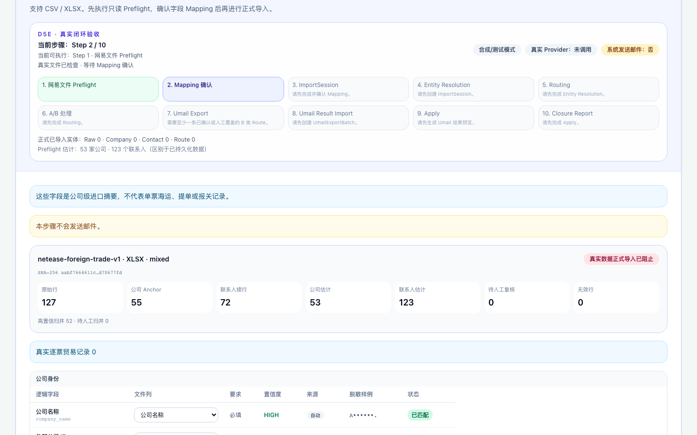

# D5e2d.1 Decision Maker Safety + Production Real Import Gate 报告

日期：2026-08-07

## Status

WAITING_FOR_USER_REAL_IMPORT —— 所有写前安全修复与生产部署完成，真实授权与
Import 必须由用户亲自触发；Codex 未执行 Import、未替用户确认。

## PR17 merge / main

- PR #17（部门邮箱不自动成为 Decision Maker）Squash Merge → `dd616bc`；
- PR #18（Preflight 部门计数统一 + API 暴露 resolution preview 字段 + CSV
  anchor 计数修复）Squash Merge → `bbad297`；
- main == origin/main == `bbad297`；工作区 clean（报告未提交前）；PR #4 未触碰。

## Production deployment

Backend / Worker / Frontend 全部自动部署至 `bbad297`，均 RUNNING；PostgreSQL /
Redis 未重建、数据未删。

## 健康

- Backend healthy；`/health/ready` 200（postgres/redis healthy，
  worker `WORKER_HEARTBEAT_OK`）；`/health/runtime` 200；
- Frontend 页面 200，健康卡“系统运行正常”，无 “—”，邮件发送始终关闭。

## Preflight（真实文件，生产 API）

127 rows · 55 anchors · 72 continuation · 0 invalid · 53 companies ·
123 contacts · 55 company summaries · 0 true shipments · 2 company merges ·
`contact_email=auto_alias(HIGH)`；`real_data_gate=blocked`。与 D5e2b.2/D5e2c
一致，无 drift。

## Department contacts / Decision Maker safety

- 真实文件部门共享邮箱 12 个（admin/info/purchase/purchasing/sales/support；
  Preflight 与归并规则 `is_department_email` 已统一，此前 9 为部分前缀统计）；
- PR #17 保证共享邮箱**永不自动成为 Decision Maker**（工作流排除 +
  测试覆盖 person→可选、department→不可选、Contact 保留、
  CompanyContact 关系保留）；
- dry check：`selected_as_decision_maker = 0`（导入前无选择，规则已强制）。

## System Gate / User Gate

- SYSTEM GATE：生产 `REAL_DATA_ACKNOWLEDGED` 未设置 → DISABLED（runtime
  `real_data_gate=blocked`），保持关闭，未绕过；
- 读取路径确认（代码）：`real_data_acknowledged` 仅 Backend 路由读取
  （bulk_import / umail_feedback / acceptance / health）；**Worker 不读取**，
  用户准备导入时只需在 Backend 服务设置 `REAL_DATA_ACKNOWLEDGED=true`；
- USER GATE：用户在 UI 勾选“我确认这是我拥有或有权处理的真实业务数据”；
- 两者独立且必须同时成立；前端 checkbox 无法绕过系统门禁，无开发模式/API
  fallback。

## Capability smoke（生产 UI，只读）

17/17：上传真实 XLSX → Preflight 成功（127/55/53/123/55/0）→ Mapping 页面正常
（联系人邮箱/职位 HIGH 自动选中）→ Resolution Preview 数字正确 → System Gate
明确显示“禁用” → 正式 Import 按钮未点击。

## 合规

无真实写入（未 Import）；未调用 LLM/外部 Provider/Umail API；未发送邮件；
报告不含完整真实邮箱。

## Blocker / Exact user action

1. Zeabur → Backend 服务环境变量设置 `REAL_DATA_ACKNOWLEDGED=true` 并等待
   重新部署（Worker 无需同步，代码确认 Worker 不读取该变量）；
2. 等待 Backend healthy；
3. 打开 https://usimporterhunter.zeabur.app/；
4. 上传 `2026-08-07_fitness_equipment.xlsx`；
5. Preflight（确认 127/55/53/123/55/0/0，12 个部门联系人）；
6. 确认 Mapping；
7. Resolution Preview：确认 rows 49/51 与 56/58 两组公司归并，查看 12 个
   department contacts；
8. 勾选真实数据授权；
9. 点击“开始正式导入”。

完成后告知，Codex 继续验证 persisted counts / 幂等 / 追溯 / Routing /
A Batch / B Preview。
