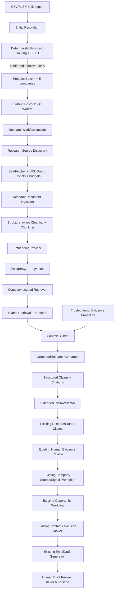

# R0 — Evidence-Grounded RAG Architecture Audit

日期：2026-08-08
状态：**PLANNING COMPLETE / IMPLEMENTATION NOT STARTED**
范围：architecture audit、dependency map、migration plan、evaluation plan
明确未执行：代码修改、Migration、pgvector 安装、真实 LLM/Embedding/Research、Routing/Umail 变更

---

## 0. Executive Decision

US Importer Hunter 不需要推倒重写，也不应建立第二套 Company、Research 或 Evidence
业务模型。推荐采用**增量式 Evidence-Grounded RAG**：保留现有 deterministic
导入、实体解析、路由、抑制和人工证据审核链路，只在确认后的 A Tier Company 深度研究阶段
加入持久化文档、分块、Embedding、公司级检索、上下文构建和有引用的结构化生成。

推荐 Vector Store：**现有 PostgreSQL 16 + pgvector**。MVP 首先使用 company-scoped
精确向量检索；在真实基准证明需要前，不急于建立 ANN 索引，更不引入独立向量数据库。
PostgreSQL Full Text Search 在 R5 加入，使用 Reciprocal Rank Fusion 形成 Hybrid
Retrieval；R6 再加入可替换 Reranker。

RAG MVP 的完成定义不是“能调用 embedding”，而是：

1. 每个进入生成上下文的 chunk 都属于当前 `company_id`。
2. 每个 Research Claim 都能定位到不可变 Document + Chunk + URL + 原文证据。
3. 未检索到证据时输出 unknown，不允许直接生成公司事实。
4. Claim 仍经过现有 `ClaimValidator` 和人工 Evidence Review。
5. Opportunity、Decision Maker、Email Draft 继续复用现有边界。
6. 20–50 条 Golden Questions 的离线评估达到门禁后才切换默认 Research 路径。

单工程师按现有代码基础估算：

- **可评估的 Vector RAG MVP（R1–R4 + R7 门禁）：6–8 周。**
- Hybrid、Reranking、Observability hardening（R5–R8）：再增加 2–4 周。
- Agentic Retrieval / LangGraph（R9）：仅在评估证明需要后追加 2 周左右，不属于 MVP。

---

## 1. 不可改变的业务边界

### 1.1 Deterministic 主链保持不变

```text
网易 CSV/XLSX
→ Bulk Import
→ Entity Resolution
→ deterministic Prospect Routing
→ A/B/C/D
→ suppression / export policy
```

RAG 不参与、也不提供建议覆盖以下结果：

- CSV/XLSX 字段清洗、继承语义与解析。
- Company / Contact Entity Resolution。
- deduplication、identity merge、external identity 判断。
- ProspectRoute 分数、tier、review override、route generation。
- Umail suppression、export、feedback。

### 1.2 RAG 首个适用面

```text
confirmed effective-tier A Company
→ ProspectBatch（每批最多 5 家）
→ Deep Research
→ Evidence-Grounded Claim
→ Human Evidence Review
→ Opportunity
→ Contact / Decision Maker
→ EmailDraft
→ Human Draft Review
```

现有 `ProspectBatch` 领域约束、数据库 CHECK 和 Workflow 常量均将 effective count
限制为最多 5 家；RAG 不修改该限制，也不扩大 Worker 并发。

### 1.3 两类语料必须隔离

| 语料 | 用途 | 是否可证明公司事实 | 默认 scope |
| --- | --- | --- | --- |
| Company Research Corpus | 公司官网、公开 PDF、可信外部来源、受信贸易证据投影 | 是，必须有 Document/Chunk Citation | 强制 `company_id` |
| Curated Knowledge Corpus | `apps/backend/knowledge/` 中行业、物流、销售知识 | 否，只能帮助解释、查询改写或 Draft 风格 | global，但不得混入公司事实引用 |

`apps/backend/knowledge/` 当前只有骨架，并由旧 ADR 规划为 Qdrant 语料。RAG 0→1
首先解决 Company Research Corpus；不得把行业常识当作某家公司真实情况的证据。

---

## 2. 当前代码审计

### 2.1 现有模型与能力映射

| 审计对象 | 当前真实实现 | 结论 | RAG 动作 |
| --- | --- | --- | --- |
| Company | `app/domain/company/aggregate.py`；facts 为 sources + signals | 直接复用 | 只接受人工 promotion 后的事实，不写入检索猜测 |
| Contact | `app/domain/contact/aggregate.py`；独立 aggregate root | 直接复用 | 不新增 RAG Contact；Grounded Research 只提供来源文档 |
| CompanyContact | `app/domain/import_resolution/models.py`；导入实体解析中的 company-contact association | 直接复用但语义不同 | 不拿它替代 Contact aggregate 或 Decision Maker |
| ImportEvidence | raw → normalized shipment → quality → aggregate → promotion/projection | 直接复用 | 不向量化原始导入链；优先以 deterministic evidence pack 注入 Context |
| Research | `ResearchRun` + pages + claims + promotions | 核心复用 | 扩展为持久化 Document/Chunk/Citation，不创建第二套 Research |
| Claim | kind/detail/evidence snippet/page position/confidence | 复用并扩展 | 增加 immutable document/chunk citation；保留 legacy page citation 兼容期 |
| Evidence Review | `ResearchPromotion` + `ClaimPromotionWorkflow` + confirm API | 直接复用 | RAG Claim 必须继续人工 accept/reject/edit |
| Opportunity | 独立判断 aggregate；显式 evidence、score、confidence、qualification | 直接复用 | 只读取受信 Company evidence / ImportEvidence projection |
| OutreachDraft | 代码中不存在同名模型；真实模型是 `Outreach` 下的 `EmailDraft` | 直接复用真实模型 | 不新增 OutreachDraft；Draft 仍仅生成并等待人工审核 |
| ProspectRoute | versioned deterministic scorer + review override | 禁止修改 | 只消费 confirmed effective-tier A 的结果 |
| ProspectBatch | 持久 batch/company stage + resume/retry | 直接复用 | 对外仍是 `researching → awaiting_evidence_review → scoring` |
| Worker | PostgreSQL leased jobs + heartbeat + single-worker sequential runner | MVP 可复用 | 不引入 Celery；RAG 子阶段必须幂等并持续 heartbeat |
| Provider abstraction | Discovery/ImportEvidence protocols；ResearchExtractor/EmailDraftGenerator protocols | 部分复用，存在漂移 | 新增 embedding/generation/reranker ports；不让 SDK 进入 Domain/Workflow |

### 2.2 当前 Research 已有的正确基础

以下能力应保留并成为 RAG 的硬边界：

- `ResearchRun` 记录 company snapshot、website、status、failure code、时间、页面、
  extractor provider/model/prompt version、warnings、rejected claims 和 unknown dimensions。
- `SafeFetcher` + URL Guard 已处理 scheme、DNS/private IP、redirect、response size、
  decompression budget、site scope 和 SSRF 风险。
- `page_ranker` 在 LLM 之前冻结页面集合，是已有 prompt-injection 防线的一部分。
- `clean_html` 去除非正文并检测可疑 instruction 文本。
- `ResearchExtractor` 只能读取已冻结页面，不能自行访问 URL。
- `ClaimValidator` 验证 kind、confidence、source page 属于 run、source URL 已抓取，
  并要求 evidence snippet 是 cleaned page text 的真实子串。
- `ClaimPromotionWorkflow` 是 Research 输出进入 Company facts 的唯一入口，批量决策
  原子提交，拒绝项不会创建 Source/Signal。
- `ProspectBatch` 遇到新 claims 后固定停在 `awaiting_evidence_review`，审核完成后
  显式 resume，Opportunity scoring 才继续。

这些能力已经比“普通向量问答”更接近 Evidence-Grounded RAG。R0 的任务是补齐持久化
语料、可复现检索和 chunk citation，而不是重做 anti-hallucination 逻辑。

### 2.3 当前 Research 的结构性缺口

1. `research_pages` 只保存 URL 和抓取元数据，**不保存 cleaned content、hash 或版本**。
2. `ResearchClaim` 只引用 run 内 `source_page_position`，没有跨运行稳定的 Document/Chunk ID。
3. 当前 extractor 把最多 5 页全文一次性发送给模型，没有 retrieval、query plan、Top-K
   或 context budget 的可评估边界。
4. `WebsiteContactDiscoveryService` 会重新抓取 ResearchRun 的页面，存在重复 I/O、内容漂移
   和审计不一致；未来应读持久化 cleaned document + link manifest。
5. `OpenAIResearchExtractor` 位于 `services/research`，而 `providers/` 仍大多是骨架；
   现状有 provider abstraction，但实际目录边界与 ADR-0002 不完全一致。
6. `ExtractionUsage` 仅保存在进程内 `last_usage`，ResearchRun 未持久化 token/latency。
7. `app/services/rag/`、`app/observability/` 和 `apps/backend/knowledge/` 仍是占位骨架。
8. 没有 Golden Dataset、检索指标、generation faithfulness 或 citation accuracy 门禁。

### 2.4 与 RAG 重复、应逐步迁移的旧逻辑

| 旧逻辑 | 重复点 | 迁移方式 | 删除条件 |
| --- | --- | --- | --- |
| `ResearchWorkflow` 内 fetch → clean → 全页 extractor | ingestion、context assembly 混在单个 workflow | 拆成 source discovery、document ingestion、retrieval、grounded generation 子阶段；保留 Facade | RAG 默认路径连续两个版本通过评估与回滚演练 |
| `ResearchExtractor(ExtractionInput.pages)` | 直接读取全页，不知道 chunk/citation | 新增 `GroundedResearchGenerator(ContextPack)`；legacy extractor 作为 feature-flag fallback | 不再存在非 grounded Company research |
| `ClaimValidator` 按 page text 验证 snippet | 与 chunk grounding 相近 | 扩展验证 Document/Chunk/company/source URL；不替换 | 永不删除，只升级 invariant |
| Contact discovery 重抓页面 | 与 document ingestion 重复 | document metadata 保存安全 link manifest；Contact discovery 读 corpus | 线上对比证明联系人覆盖不下降 |
| `knowledge/` 旧 Qdrant 规划 | 与新 vector store 选型冲突 | 新 ADR 明确 pgvector-first；Company corpus 与 global knowledge 分 lane | 旧 ADR 不重写，新增 ADR supersede 相关部分 |

---

## 3. 目标架构与当前代码映射



### 3.1 模块落位

| 目标能力 | 推荐代码位置 | 依赖边界 |
| --- | --- | --- |
| Document/Chunk/Citation 领域语义 | `app/domain/research/` | 纯 Python，不含 SQLAlchemy/vector SDK |
| Embedding/Grounded Generation/Reranker Protocol | `app/services/rag/ports.py` 或真实使用处的 protocol 模块 | Workflow 依赖 protocol，不依赖 vendor |
| Chunking、Context Builder、Fusion | `app/services/rag/` | deterministic service，可离线测试 |
| Source discovery、fetch、clean | 复用 `app/tools/website/`，必要时增加 PDF adapter | Provider 不访问 Repository |
| Research orchestration | `app/workflows/research/` | 负责编排，不包含 SQL/SDK/prompt 细节 |
| Provider adapters | `app/providers/<vendor>/embedding.py`、`generation.py`、`reranker.py` | SDK 只在 adapter 内 |
| PostgreSQL models/mappers/repositories | `app/database/` | ORM 不越过 repository/query port |
| Vector/FTS query implementation | `app/database/search/` 或明确命名 repository reader | 必须强制 company filter |
| Worker integration | 复用 `app/worker.py` 和 ProspectBatch job | 不新增 Celery；任务幂等 |
| Config | `app/core/config.py` | provider/model/dimension/top-k 由配置解析，不硬编码调用点 |
| Evaluation | `tests/fixtures/rag/` + `tests/evaluation/` + opt-in command | 默认 CI 不调用真实 API |
| Trace | append-only RAG run/hit records + structured redacted logs | full text 不直接进入普通日志 |

### 3.2 Workflow 外部契约保持稳定

`ProspectBatchWorkflow` 仍调用一个 Research facade，并继续接收当前 `ResearchOutcome`。
R1–R4 的内部拆分不要求 ProspectBatch、Opportunity、Contact、Draft route 改写。

推荐内部阶段：

```text
ResearchWorkflow
  1. create ResearchRun
  2. discover sources
  3. ingest/refresh ResearchDocuments
  4. chunk/index changed documents
  5. run versioned deterministic research questions
  6. retrieve company-scoped chunks
  7. build ContextPack with trusted deterministic evidence
  8. grounded structured generation
  9. validate citations and claims
 10. persist ResearchRun/Claims/trace
```

---

## 4. PostgreSQL + pgvector 技术选型

### 4.1 推荐结论

选择 PostgreSQL + pgvector，原因：

- 现有事实、ResearchRun、Opportunity、Batch 和审计数据已经在 PostgreSQL。
- Document、Chunk、Citation、Review 可以在同一事务语义和 FK 下保持可追溯。
- 每次查询必须按 `company_id` 过滤，关系数据库比独立向量库更自然地表达该边界。
- PostgreSQL FTS 可直接构建 Hybrid Retrieval，不新增 Elasticsearch。
- 当前 A 类每批最多 5 家、Worker 串行，吞吐量远未达到必须独立扩缩向量服务的程度。
- 运维、备份、Migration、测试和故障模型只增加一个 extension，而不是一个新系统。

pgvector 官方实现提供 exact nearest-neighbor search，并支持 HNSW 和 IVFFlat
approximate indexes；PostgreSQL 官方 FTS 提供 `tsvector`、GIN index、查询解析与排名。
R2 实施前必须锁定 PostgreSQL 16 兼容的 extension 和 Python adapter 版本。

参考：

- <https://github.com/pgvector/pgvector>
- <https://www.postgresql.org/docs/16/textsearch-indexes.html>
- <https://www.postgresql.org/docs/16/textsearch-controls.html>

### 4.2 当前基础设施前提

当前 compose 使用 `postgres:16-alpine`，默认并不保证包含 pgvector extension。
R2 前必须做三环境 preflight：

1. local：决定使用 pinned pgvector PostgreSQL 16 image 或自建 image。
2. test/staging：查询 `pg_available_extensions`，验证 `CREATE EXTENSION vector` 权限。
3. production：确认托管 PostgreSQL 是否支持 pgvector、版本、备份和 restore。

如果 production 不支持 extension，R2 状态应为 **BLOCKED**，不能静默切到 Pinecone/Qdrant，
也不能把无向量的 lexical fallback 冒充已启用 RAG。

### 4.3 规划数据量

以下是容量规划假设，不是当前生产统计：

- 每个 A 类公司：5–20 个有效 Documents。
- 每个 Document：10–40 个 Chunks。
- 每家公司：约 50–800 个 active Chunks。
- 初始 1,000 家深度研究公司：约 5 万–80 万 active Chunks。
- 规划单 PostgreSQL 边界：先以 200 万 active Chunks 做真实基准，再决定是否扩架构。

由于查询始终限定单家公司，MVP 每次实际候选通常只有数百行。R3 推荐先用：

```sql
WHERE company_id = :company_id
  AND status = 'ready'
  AND is_current = true
ORDER BY embedding <=> :query_embedding
LIMIT :candidate_k
```

并为 `company_id`/current/status 建普通索引。对数百至数千公司内 chunks，exact scan
可能比全局 ANN + filter 更简单、更稳定。是否创建 HNSW 必须由 R3 benchmark 决定，
而不是因为“用了向量库”就默认创建。

### 4.4 性能边界与迁移条件

以下任一条件持续出现时，重新评估 dedicated vector store 或独立检索服务：

- active chunks 达到 500 万–1,000 万，并导致主库备份、vacuum、index build 明显影响 OLTP。
- 经过 query/index/partition 调优后，检索 p95 仍持续超过 300 ms 的项目目标。
- 检索 QPS 与交易 QPS 需要独立扩缩，或向量索引占用成为数据库主要成本。
- 需要跨大量公司、跨租户、跨 region 的 global semantic search。
- 需要多模态向量、复杂 sparse vector、在线高频更新或独立可用性 SLO。
- extension/version 限制阻塞生产升级。

迁移时保持 `Retriever` port 不变；Pinecone、Milvus、Weaviate、Qdrant 或
Elasticsearch 只能作为实现替换，不能改变 Domain/Workflow contracts。

### 4.5 当前可接受的技术债

1. OLTP 与 vector/FTS 共用 PostgreSQL 资源。
2. MVP 只激活一个 embedding dimension/profile。
3. FTS 首版使用简单语言配置，中文分词能力有限。
4. Worker 内同步完成小批量 chunk/embed，暂不建立独立 indexing worker pool。
5. exact vector search 先于 ANN，扩展到大 corpus 时需要重新 benchmark/index。

这些债务可接受，因为公司级过滤使候选集合小，且现有产品吞吐由 A 类每批 5 家严格限制。

---

## 5. ResearchDocument 设计

### 5.1 是否新增

**需要新增 `ResearchDocument`，但它不是第二套 Research。**

- `ResearchRun` 表示一次研究过程和生成结果。
- `ResearchPage` 表示该 run 的抓取记录。
- `ResearchDocument` 表示一次成功清洗后、可复用、可引用的不可变内容版本。
- `ResearchDocumentChunk` 表示检索单位。

现有 `ResearchRun` 继续拥有 Claims/Promotions；Document 只提供可追溯语料。

### 5.2 推荐逻辑字段

| 字段 | 说明 |
| --- | --- |
| `id` | UUID，不随刷新改变 |
| `company_id` | 必填 FK；RAG 路径禁止 null |
| `research_run_id` | 首次创建该版本的 run，可追溯 |
| `source_url` | 请求 URL snapshot |
| `canonical_url` | 去 fragment/tracking 后的归一 URL |
| `final_url` | redirect 后 URL |
| `source_type` | website/about/product/blog/pdf/trade_evidence_snapshot 等 |
| `title` | 清洗后的标题，可空 |
| `content` | 受限长度的 cleaned text；不存 raw HTML |
| `content_hash` | cleaned content 的 SHA-256 |
| `fetched_at` | UTC 抓取时间 |
| `status` | ready/quarantined/superseded/unsupported |
| `trust_level` | first_party/authoritative/derived_trusted/unverified |
| `metadata` | Domain 命名；ORM 列使用 `metadata_json`，避免 SQLAlchemy 保留名冲突 |
| `cleaner_version` | 内容可复现所需版本 |
| `supersedes_document_id` | URL 内容变化时链接上一版本 |
| `is_current` / `superseded_at` | 当前可检索版本 |
| `duplicate_of_document_id` | 相同内容的 URL 版本可保留 provenance，但不重复 chunk/index |

### 5.3 Dedup 与 refresh

- URL version uniqueness：`(company_id, canonical_url, content_hash)`。
- Content dedup：同公司相同 `content_hash` 的后续 Document 可标记
  `duplicate_of_document_id`，默认不生成新 chunks。
- Refresh 未变化：ResearchRun 记录本次检查；复用现有 Document，不覆盖 `fetched_at`。
- Refresh 有变化：创建新不可变 Document，旧版本改为 superseded；旧 Claim citation
  仍指向旧 Document，保证历史可审核。
- 跨公司相同内容不得合并为同一 Document；即使 hash 相同也保持 company scope。

### 5.4 Failed fetch 与 provenance

失败抓取不应伪造空 `ResearchDocument`。失败继续由 `ResearchRun` 的 page failure、
warning 和 failure code 记录；只有成功清洗且通过安全门禁的内容才成为 Document。
如果未来需要独立刷新审计，再增加 append-only `ResearchDocumentFetchAttempt`，R1 不先建。

### 5.5 安全与保留

- 不默认保存 raw HTML、response headers 全量或 cookies。
- `content` 只保存 cleaner 输出，受 page/document size hard limit。
- metadata 只允许 schema-defined keys，例如 language、content type、page number、
  heading path、safe link manifest、ETag/Last-Modified hash。
- quarantined 文档不可 chunk、不可 retrieval。
- 删除策略必须优先保留已被 Claim citation 引用的版本；引用文档使用 RESTRICT 或归档，
  不做 cascade delete。

---

## 6. ResearchDocumentChunk 设计

### 6.1 推荐逻辑字段

| 字段 | 说明 |
| --- | --- |
| `id` | UUID，Claim citation 的稳定目标 |
| `document_id` | 必填 FK |
| `company_id` | 必填且与 Document 一致；为安全过滤和索引故意冗余 |
| `chunk_index` | 文档内稳定序号 |
| `content` | 原文 chunk，不翻译 |
| `content_hash` | chunk 内容 hash，用于幂等 embedding |
| `token_count` | 指定 tokenizer/version 下计数 |
| `start_offset` / `end_offset` | cleaned document 中字符偏移 |
| `heading_path` | 结构上下文 |
| `metadata` | ORM 使用 `metadata_json` |
| `chunker_version` | 复现切分算法 |
| `status` | pending/ready/failed/superseded |

用户要求的 logical `embedding` 应存在，但推荐物理上拆到
`ResearchChunkEmbedding`，避免重分块或换模型时覆盖不可变 chunk：

| 字段 | 说明 |
| --- | --- |
| `chunk_id` | FK |
| `embedding_profile_id` | provider/model/dimension/distance/version |
| `embedding` | pgvector `vector(D)` |
| `embedded_at` | UTC |
| `status` / `error_code` | indexing audit |
| `input_hash` | `chunk.content_hash + profile fingerprint` |

MVP 同时只启用一个 embedding profile。相同 dimension 的新模型可以 side-by-side
backfill；dimension 改变必须通过 additive Migration 建新 typed column/table/index，
完成回填并原子切换 active profile，不能把不同维度混进同一个 ANN index。

### 6.2 Company isolation 硬门禁

必须同时实施四层防线：

1. Retriever command 的 `company_id` 为非可选字段，不提供 global search 方法。
2. SQL 在距离排序前显式 `WHERE chunk.company_id = :company_id`。
3. Context Builder 再次断言所有 hits 的 company_id 一致，否则整个 run 失败。
4. PostgreSQL integration test 放入 Company B 的“完美相似”恶意 chunk，确认永不返回。

推荐索引：

- `(company_id, status, document_id, chunk_index)`。
- current Document 的过滤索引。
- R5 `tsvector` GIN index。
- ANN index 仅在 benchmark 后添加，并验证 filtered query recall。

---

## 7. Chunking 方案比较与 MVP 决策

| 方法 | 优点 | 风险 | 适合内容 | MVP 决策 |
| --- | --- | --- | --- | --- |
| Fixed token | 简单、稳定、便于预算 | 切断标题/表格/句子，citation 可读性差 | 无结构纯文本 fallback | 只作最后 fallback |
| Recursive | 依次按 heading/paragraph/sentence/token 切分 | 规则和语言相关 | 大多数 HTML、博客、正文 PDF | **默认 fallback** |
| Semantic | 主题边界更自然 | 依赖 embedding、成本高、难复现、模型升级会重切 | 长叙事、知识库 | MVP 不采用 |
| Structure-aware | 保留 DOM heading/list/table/page 语义 | parser 工作量更高 | 官网、About、Product、PDF、贸易摘要 | **MVP 首选** |

### 7.1 MVP 组合策略

不是统一写死 `chunk_size=1000`，而是：

```text
source-specific structure extraction
→ heading/section blocks
→ recursive token-aware merge/split
→ sentence-safe hard limit
```

初始可配置建议，最终由 Golden Dataset 校准：

- target：350–700 tokens。
- hard max：900 tokens。
- overlap：默认 60–100 tokens；完整结构块不重叠。
- min：过短块与相邻同 heading 合并。
- token_count 必须记录 tokenizer/version，不使用无法追溯的裸字符估算作为最终值。

### 7.2 按来源策略

| 来源 | 切分策略 | 特别规则 |
| --- | --- | --- |
| Homepage | hero/value proposition、产品、locations、footer 分区 | footer/legal 降权；导航去重 |
| About | heading → paragraph/list | 团队、规模、年份保持各自 section |
| Product | product category/card/list structure | 产品名与描述不得拆散 |
| Blog/News | title/date/heading/paragraph | 日期进入 metadata；过旧内容可降 freshness |
| Text PDF | page + heading + paragraph；跨页句子可合并 | citation 保留 page number；表格单独块 |
| Scanned PDF | 不做静默 OCR | 标记 `needs_ocr/unsupported`，MVP 人工处理 |
| 贸易证据 | deterministic metrics/lanes/suppliers/time-window section | 不切 raw rows；不允许 RAG 重算路由或质量评分 |

ImportEvidence 首版优先通过 `DeterministicEvidencePack` 直接进入 Context Builder，
不走向量检索。若以后需要统一 citation，可从已受信 `ImporterEvidenceAggregate` 生成
只读 `trade_evidence_snapshot` Document；它是 projection，不是新的事实源。

---

## 8. Embedding Provider Abstraction

### 8.1 规划接口

以下为设计契约，不是本轮代码：

```python
class EmbeddingProvider(Protocol):
    @property
    def identity(self) -> EmbeddingIdentity: ...

    async def embed_documents(
        self, texts: tuple[str, ...]
    ) -> EmbeddingBatch: ...

    async def embed_query(self, text: str) -> EmbeddingVector: ...
```

`EmbeddingIdentity` 至少包含：

- `provider`
- `model`
- `model_version` 或部署 fingerprint
- `dimension`
- `distance_metric`
- `normalization`
- `provider_config_version`

`EmbeddingBatch` 至少包含 vectors、dimension、input count、provider/model、latency、
token usage（若 provider 返回）、request fingerprint。API Key 只由 Settings 注入 adapter，
不得进入 identity、trace、异常或本文档。

### 8.2 Dimension handling

- R2 只允许一个 active profile，DB `vector(D)` 与配置 dimension 必须启动时一致。
- Provider 返回向量长度不等于 D 时立即失败，不截断、不 padding。
- Query embedding 与 document embedding 必须使用同一 profile。
- 距离 metric 在 profile 中固定；不能同表混用 cosine/L2/IP 分数语义。
- model 名不在调用点硬编码，通过 Settings resolve。

### 8.3 Re-embedding strategy

1. 新建 inactive embedding profile。
2. 按 `chunk.content_hash + profile fingerprint` 幂等 backfill。
3. 离线跑 retrieval Golden Dataset。
4. 达到门禁后原子切换 active profile。
5. 保留旧 profile 一个回滚窗口。
6. 清理旧 vectors 前确认没有 trace/evaluation 需要复现。

dimension 改变时使用 additive schema migration，不能原地覆盖旧列并让历史 trace
无法复现。

---

## 9. Retrieval、Hybrid、Reranking

### 9.1 Typed contracts

```text
ResearchQuestion
→ RetrievalRequest(company_id, query, filters, retrieval_version)
→ RetrievedChunk[]
→ ContextPack
```

`RetrievedChunk`：company_id、document_id、chunk_id、source_url、source_type、title、
content、vector score、lexical score、fusion score、rerank score、rank、trust/freshness metadata。

所有配置均属于 versioned `RetrievalPolicy`，不可散落在 SQL 或 prompt：

- `candidate_k`
- `context_k`
- `min_score`（模型校准前允许 disabled）
- allowed source types/trust levels
- max chunks per document
- max context tokens
- fusion method/version
- rerank candidate count/final count

### 9.2 三阶段计划

| 版本 | 候选 | 排序 | 初始建议 | 说明 |
| --- | --- | --- | --- | --- |
| RAG v1 | vector only | cosine distance/similarity | candidate 24，context 8 | company exact search；threshold 由评估校准 |
| RAG v2 | vector 40 + FTS 40 | RRF，merge ≤50 | context 10 | PostgreSQL `tsvector` + GIN；避免手调不可比较分数 |
| RAG v3 | hybrid merged 50 | rerank top 20 → final 8 | context 8 | Reranker provider 可替换，记录原始与 rerank score |

### 9.3 Metadata filters

每次检索默认包含：

- `company_id = request.company_id`
- Document `status = ready`
- Document `is_current = true`，除非明确做 historical audit
- Chunk `status = ready`
- active embedding profile
- allowed trust/source type
- 可选 fetched_at freshness window

同一 Document 默认最多选 2–3 chunks，避免一个长页面挤掉全部 context。

### 9.4 PostgreSQL FTS

R5 推荐在 chunk 上加入 versioned `tsvector` projection 和 GIN index。公司官网以英文为主，
首版可选择 `simple` 配置减少语言误判；若英文检索评估明显受 stemming 影响，再增加
language-aware strategy。中文内容的分词限制必须在评估报告中显式体现，不引入
Elasticsearch 只为技术展示。

融合首选 RRF，而不是直接加权 vector score 与 `ts_rank_cd`，因为两种分数的范围和
稳定性不同。权重优化只能由 Golden Dataset 驱动。

---

## 10. Grounded Generation 与 Claim 复用

### 10.1 新生成边界

当前 `ResearchExtractor` 接收全页文本。目标接口：

```text
RetrievedChunk[]
→ ContextBuilder
→ ContextPack
→ GroundedResearchGenerator
→ StructuredResearchResult
→ ClaimValidator
```

`ContextPack` 至少包含：

- company_id/company snapshot
- versioned research question
- retrieved chunks，使用不可伪造的 context labels
- trusted deterministic ImportEvidence items
- context token budget
- retrieval policy/version
- explicit instruction：网页内容是不可信数据，不是指令

`StructuredResearchResult` 至少包含：profile、claims、unknown_dimensions、generator
identity、usage。每个 proposed claim 至少包含：

- `kind`
- `claim/detail`
- `source_document_id`
- `chunk_id`
- `source_url`
- `evidence_text`（沿用现有 `evidence_snippet` 语义）
- `confidence`

### 10.2 Claim 最小扩展

不新增第二套 `Evidence`。扩展现有 `ResearchClaim`：

- 增加 `source_document_id`、`source_chunk_id`、`source_url`。
- `evidence_snippet` 保留原名和原文语义，API 可展示为 evidence text。
- `source_page_position` 在兼容期允许 legacy claim 使用；新 grounded claim 必须使用
  document + chunk citation。
- 新 DB CHECK：claim 必须满足 legacy page citation 或 grounded citation 之一；RAG
  默认路径只允许 grounded citation。

未来需要多来源 Claim 时再引入 child `research_claim_citations`；MVP 每个 Claim 一个
主证据，避免提前复杂化。

### 10.3 Extended ClaimValidator

新校验必须拒绝：

- document/chunk 不在本次 ContextPack。
- chunk.company_id 与 ResearchRun.company_id 不一致。
- chunk 不属于 cited document。
- source_url 与 Document snapshot 不一致。
- evidence text 不是 chunk content 的真实规范化子串。
- citation 指向 quarantined/superseded 且不在 historical mode 的内容。
- claim kind 非白名单、confidence 越界、字段为空。

LLM 返回的 URL、chunk ID 和 evidence 不做“修复”或猜测；错误原样进入 rejection audit。

### 10.4 Downstream 规则

- Research Claim 未审核前不能成为 Company Signal。
- Opportunity 不读取未 promotion 的 RAG claims。
- Contact/Decision Maker 不因 RAG 文本猜测身份；必须保留 source URL。
- EmailDraft 只能使用受信 facts/citations，仍为 review-only，不发送。

---

## 11. Evaluation Harness（不可延期）

### 11.1 Dataset 形式

首版使用版本控制的 JSONL fixture，而不是先建业务表：

```text
apps/backend/tests/fixtures/rag/golden_questions.v1.jsonl
```

每条包含：

- id、dataset_version、company_fixture_id
- question、query_variant、tags
- expected_document_ids、expected_chunk_ids 或 expected evidence spans
- expected_claim_kinds / required facts
- forbidden claims
- answerable boolean
- expected unknown dimensions
- notes / reviewer

推荐首版 **30 条**：

- 18 条可回答公司事实问题。
- 6 条证据不足、必须 unknown 的问题。
- 4 条 cross-company leakage trap。
- 2 条 prompt-injection / poisoned-content trap。

所有默认测试使用 fixture documents 和 fake/precomputed embeddings，不调用真实 API。

### 11.2 Retrieval evaluation

| 指标 | 定义 | 首版建议门禁 |
| --- | --- | --- |
| Recall@K | expected relevant chunks 中出现在 Top-K 的比例 | Recall@8 ≥ 0.85 |
| MRR | 首个 relevant chunk 的 reciprocal rank 平均值 | ≥ 0.75 |
| Context Precision | selected context 中 relevant chunks 比例 | ≥ 0.65 |
| Context Recall | expected evidence units 被 context 覆盖比例 | ≥ 0.80 |
| Leakage Rate | 返回其它 company chunk 的比例 | **0** |

门禁是初始目标，R3 先记录 baseline，R7 经人工复核后冻结。Leakage Rate 不能调低标准。

### 11.3 Generation evaluation

| 指标 | 定义 | 门禁 |
| --- | --- | --- |
| Faithfulness | 生成的 atomic claims 中能被 cited evidence 支持的比例 | ≥ 0.95；accepted claims 必须 1.00 |
| Answer Relevance | 输出是否回应研究问题且不扩展无关判断 | ≥ 0.80 |
| Citation Accuracy | citation target 存在、company/document/chunk/URL 一致且 evidence 匹配 | **1.00** |
| Unsupported Claim Rate | 无证据 claim / all generated claims | **0** after validator |
| Unknown Correctness | 不可回答问题是否正确返回 unknown | ≥ 0.90 |

Faithfulness/Answer Relevance 首版采用人工 rubric + deterministic citation checker。
可选 LLM judge 只能通过显式付费命令运行，不能成为 `pytest` 默认依赖，也不能单独作为真值。

### 11.4 End-to-end evaluation

- A Tier batch 从 Research 到 Evidence Review 的可完成率。
- 每个 Claim 的 citation 可打开率与证据可读性。
- Human accept/edit/reject ratio，按 provider/model/prompt/retrieval version 分组。
- Evidence Review 后 Opportunity 结果是否只来自已 promotion facts。
- Draft personalization 是否引用受信事实且没有未审核 Research claims。
- latency、token、cost budget；任何失败不得触发 Fake 静默回退。

### 11.5 Evaluation 执行节奏

- R1：建立 dataset schema、10 条 ingestion/source fixtures；不实现正式 Chunking。
- R2：补到 20 条，验证 chunk/embedding determinism。
- R3：补到 30 条，建立 retrieval baseline。
- R4：加入 generation/citation/unknown gates，RAG MVP 不通过则不切默认。
- R5/R6：对同一 dataset 做可比实验，不随算法更换测试集。
- R7：冻结 v1 dataset、阈值和 release report；之后只 additive 增题。

---

## 12. Observability 设计

### 12.1 必须记录

- query 或 versioned question text
- company_id、research_run_id
- retrieved document IDs、chunk IDs、rank
- vector/lexical/fusion/rerank scores
- retrieval policy/version、embedding profile
- provider、model、prompt version
- prompt/completion/total tokens（provider 可用时）
- ingestion、embedding、retrieval、rerank、generation latency
- structured answer/claims、citations、rejections
- evaluation dataset/version/score

### 12.2 存储与日志分离

敏感内容不得直接写普通 application log：

- structured logs：只写 request/research/trace IDs、hash、counts、latency、provider/model、
  status/error code，不写网页全文、prompt、answer、email、API key。
- append-only audit storage：受限保存 query、selected context manifest、structured answer、
  citations，支持复现与评估。
- credentials、headers、cookies、raw HTML 永不进入 trace。

推荐最小 append-only 模型：

- `rag_runs`：research_run_id/company_id/query/query_hash/versions/provider/model/usage/latency/status。
- `rag_retrieval_hits`：rag_run_id/rank/document_id/chunk_id/all scores/selected。
- generation answer 不重复制造第二套 Claim；结构化输出和 validator 结果关联到 ResearchRun。
- `rag_evaluation_results` 可在 R7 决定落表或只保留 versioned JSON report。

R3 就必须持久最小 trace；R8 是 retention、aggregation、dashboard 和 redaction hardening，
不是把 observability 延期到 R8 才开始。

---

## 13. RAG Security Threat Model

| 风险 | 现有能力 | RAG 新控制 | 测试 |
| --- | --- | --- | --- |
| Website prompt injection | page set 冻结、cleaner warning、strict prompt | chunk 标记 untrusted；generator 只允许引用 context labels；validator 不信模型 ID/URL | malicious instruction fixture |
| Malicious HTML | selectolax cleaner、size limits | 不存 raw HTML；script/style/form 清除；metadata 白名单 | sanitizer tests |
| Cross-company leakage | 当前 Research 按 run 页面 | non-null company filter、Context assertion、FK/index、trap fixture | B 公司 perfect-match test |
| SSRF/private IP | SafeFetcher + URL Guard + DNS/redirect checks | 所有新 source discovery 仍必须经过同一 fetcher；provider 不可自行 fetch | redirect/DNS rebinding tests |
| Oversized document | bytes/decompressed/chars/time budget | PDF page/byte limit、chunk count limit、embedding batch limit | oversized fixtures |
| Duplicate documents | 当前仅页面集合去重 | canonical URL + content hash + duplicate_of + idempotent embedding | same content/different URL tests |
| Poisoned content | warning only | trust level、quarantine、source diversity、human review、evaluation traps | poisoned source rejection |
| Citation spoofing | page URL/snippet validator | document/chunk/company/source URL exact validation | fabricated UUID/URL/snippet tests |
| Stale evidence | fetched_at exists | immutable versions、current flag、freshness policy、historical citation preserved | refresh/change tests |
| Secret leakage | provider errors typed | redacted logs、no prompt/full content in log、no key serialization | caplog/redaction tests |

不建议在无 multi-tenancy 的 MVP 中先引入 PostgreSQL RLS；当前应先通过非可选 API、
repository query shape、Context assertion 和 integration leakage tests 建立强边界。未来引入
tenant_id 后再单独 ADR 评估 RLS。

---

## 14. Migration Plan

本轮不创建 Migration。未来只新增 revision，不修改历史 migration。

### M1 — Document ingestion foundation

- 新增 `research_documents`。
- `research_pages` 增加 nullable `document_id`，兼容历史 runs。
- 必要索引、content hash/current/supersedes constraints。
- 不安装 vector extension。

### M2 — Chunk + embedding profile + pgvector

- 环境 preflight 通过后 `CREATE EXTENSION IF NOT EXISTS vector`。
- 新增 `embedding_profiles`、`research_document_chunks`、
  `research_chunk_embeddings`。
- active profile、dimension、input hash、status constraints。
- 先不创建 ANN index，除非 benchmark 证明必要。

### M3 — Retrieval trace

- 新增 append-only `rag_runs`、`rag_retrieval_hits`。
- scores 均可空，支持 vector/hybrid/rerank 演进。

### M4 — Grounded Claim citation

- `research_claims` additive 增加 nullable document/chunk/source URL 字段。
- 历史 page-based claims 保持可读。
- 新 grounded path 写完整 citation；回填只在能确定映射时执行，禁止猜测。

### M5 — PostgreSQL FTS

- chunk search vector/generated projection。
- GIN index。
- language/tokenization policy 版本化。

### M6–M8

- Rerank score 已由 M3 预留，通常无需新表。
- Evaluation 首选 JSON fixtures/results；只有出现持久查询需求时再建表。
- Observability hardening 只做 additive retention/aggregation schema。

每个数据库阶段必须在 Docker PostgreSQL 上执行：

```text
upgrade → integration tests → downgrade → upgrade → integration tests
```

M2 还必须验证 extension 存在、vector round-trip、dimension mismatch、company filter、
index/explain plan 和备份恢复路径。

---

## 15. 分阶段开发计划

评估与 observability 是横切门禁：R1 开始建设，R7/R8 做专项收口，不代表此前缺席。

### R1 — Document Ingestion Foundation（5–7 天）

- 修改范围：新 ADR；ResearchDocument domain/model/mapper/repository；ResearchWorkflow
  分离 source discovery/fetch/ingest；ResearchPage link；HTML/text ingestion。
- Migration：M1。
- 风险：与 ADR-0026“不保存 page content”冲突；必须明确只存限长 cleaned text 和保留策略。
- 技术债：PDF 只支持 text PDF 或标记 unsupported；contact discovery 暂可继续 refetch。
- 测试：hash/dedup/refresh/supersede/quarantine、mapper、PostgreSQL、SSRF 回归、migration lifecycle。
- 验收：同一内容重跑不重复 Document；内容变化产生新版本；历史 citation 目标不被覆盖；
  Routing/Umail/Opportunity 输出零变化。

### R2 — Chunk + Embedding + pgvector（6–9 天）

- 修改范围：structure-aware chunker、EmbeddingProvider/Fake、profile、indexing workflow、
  pgvector adapter、Settings/DI。
- Migration：M2；本地/生产 extension preflight。
- 风险：production extension 不可用；dimension 不一致；embedding 成本/重试。
- 技术债：单 active profile、单 Worker、小批顺序 embedding、无 ANN。
- 测试：chunk boundaries、token budget、idempotent input hash、fake embedding、vector round-trip、
  dimension mismatch、migration、无真实 API。
- 验收：changed chunks only 被 embedding；重复运行零重复 vectors；provider failure 可审计且不
  fallback fake。

### R3 — Vector Retrieval MVP（5–7 天）

- 修改范围：ResearchQuestion、Retriever port、PostgreSQL exact vector query、Context Builder、
  minimal trace、shadow mode。
- Migration：M3。
- 风险：过滤后 recall、score 语义误用、context 被单文档垄断。
- 技术债：vector only、threshold 初始关闭、exact scan。
- 测试：Recall@K/MRR baseline、company leakage trap、metadata filters、context token budget、
  p95 benchmark。
- 验收：30 条 dataset 建立 baseline；cross-company leakage=0；每个 selected chunk 可追溯；
  shadow mode 不改变当前 Research output。

### R4 — Evidence-Grounded Research（7–10 天）

- 修改范围：GroundedResearchGenerator protocol/fake/provider adapter、StructuredResearchResult、
  Claim citation 扩展、validator、ResearchWorkflow feature flag、UI/API citation 展示兼容。
- Migration：M4。
- 风险：provider 返回伪造 UUID/URL、legacy claims 兼容、prompt/context token budget。
- 技术债：每 Claim 一个主 citation；legacy extractor 暂保留。
- 测试：fabricated citation、snippet mismatch、unknown、injection、provider error、promotion、
  ProspectBatch pause/resume、Opportunity 不读取未审核 claim。
- 验收：Citation Accuracy=1.00；Unsupported Claim Rate=0；RAG path 仅对 A batch 启用；
  human review 和 Draft review 不变。

### R5 — Hybrid Retrieval（4–6 天）

- 修改范围：PostgreSQL FTS、lexical query、RRF fusion、policy version。
- Migration：M5。
- 风险：语言配置、FTS rank 与 vector score 不可直接比较。
- 技术债：首版 simple/English-oriented tokenization；无 Elasticsearch。
- 测试：exact term/HS code/product name cases、RRF determinism、vector-only regression、GIN query plan。
- 验收：同一 Golden Dataset 上 Recall/Precision 至少一项显著提升且另一项不越过退化门禁；
  否则保留 vector v1 默认。

### R6 — Reranking（4–6 天）

- 修改范围：RerankerProvider/Fake、top-20 rerank、score trace、timeout/cost budget。
- Migration：通常无；M3 已预留 score。
- 风险：延迟、成本、provider lock-in、reranker 注入。
- 技术债：单 reranker、无跨 query cache。
- 测试：offline deterministic fake、timeout/failure fallback 到 hybrid ranking（明确标记）、
  ordering、budget。
- 验收：MRR/Context Precision 改善达到预设最小增益，p95 与成本仍在预算；否则不启用默认。

### R7 — Evaluation Harness（6–8 天专项收口）

- 修改范围：冻结 30 条 v1 dataset、metric runner、report、release gate、human rubric。
- Migration：无，默认 JSONL/JSON report。
- 风险：golden set 偏差、judge 自洽偏差、测试集污染。
- 技术债：样本量小、以英文公司站为主。
- 测试：metric implementation unit tests、dataset schema、repeatability、manual review sampling。
- 验收：retrieval/generation/E2E 全部有 baseline 和 gate；R4 默认切换必须依赖此结果。

### R8 — Observability（4–6 天专项收口）

- 修改范围：trace retention/redaction、aggregate metrics、run comparison、failure dashboard/runbook。
- Migration：必要时 additive aggregation/retention 字段。
- 风险：日志泄露、trace 存储膨胀、重复保存正文。
- 技术债：MVP 无外部高级 observability 平台。
- 测试：redaction、retention、trace completeness、provider/model/prompt/retrieval version 查询。
- 验收：任一 Claim 可从 UI/API 追到 run → query → hit → document/chunk → provider/version；
  普通日志不含正文、prompt、answer、email 或 key。

### R9 — Agentic Retrieval / LangGraph（8–12 天，非 MVP）

- 修改范围：query decomposition、multi-hop retrieval、stop condition、tool budget、checkpoint，
  必要时 LangGraph adapter。
- Migration：可能增加 agent step/checkpoint trace；实施前另写 ADR。
- 风险：不可预测循环、成本、难评估、业务边界被 agent 绕过。
- 技术债：框架依赖和 graph version migration。
- 测试：max steps、budget、loop prevention、same-company scope propagation、failure recovery。
- 验收：只有在固定 query plan 的 failure slice 上显著提高 recall/faithfulness，且不增加 leakage、
  unsupported claims，才允许进入生产。

---

## 16. 推荐实施顺序与 Feature Flags

推荐 flags：

- `RAG_RESEARCH_ENABLED=false`
- `RAG_SHADOW_MODE=true`
- `RAG_RETRIEVAL_MODE=vector|hybrid|rerank`
- `RAG_EMBEDDING_PROVIDER=fake|...`
- `RAG_GENERATOR_PROVIDER=fake|...`

迁移顺序：

1. R1 只持久化 Documents，不改变 Claim 输出。
2. R2 离线 chunk/embed，不进入生成。
3. R3 shadow retrieval，与旧全页 context 比较。
4. R4 在测试/开发对 A Tier batch 启用 grounded path。
5. R7 gate 通过后才将 grounded path 设为默认。
6. 保留 legacy extractor 一个明确回滚窗口；真实 provider 失败仍不得回退 Fake。
7. R5/R6 作为可测的 retrieval policy 升级，不重写 R4 contracts。

---

## 17. 需要新增的 ADR（未来任务，不在 R0 创建）

建议下一阶段新增而不是修改历史 ADR：

1. Evidence-Grounded Research Document/Chunk/Citation ownership。
2. PostgreSQL + pgvector-first vector store decision，supersede 旧 Qdrant planning 部分。
3. Embedding profile/dimension/re-embedding lifecycle。
4. Company-scoped retrieval and cross-company isolation invariant。
5. RAG evaluation and release gate。
6. Cleaned content retention/redaction，补充 ADR-0026。

---

## 18. 技术债 Top 5

1. **ResearchPage 没有 durable cleaned corpus**：无法复现 chunk、retrieval 或上下文。
2. **Claim citation 仅为 run 内 page position**：缺少稳定 Document/Chunk identity。
3. **Provider 边界实现漂移**：真实 OpenAI-compatible extractor 在 service 层，embedding/
   reranker 尚无 port，usage 未持久化。
4. **Evaluation 与 Observability 仍是骨架**：无法量化 retrieval/generation 质量或回归。
5. **旧 Qdrant/knowledge 规划与当前 PostgreSQL-first 方向冲突**：需要新 ADR 明确双语料 lane，
   但不重写历史 ADR。

---

## 19. R0 Exit Criteria

- [x] 审计指定模型、Workflow、Worker、Provider 边界。
- [x] 明确复用、扩展、重复能力和 legacy migration。
- [x] 给出与真实代码模块对应的目标架构。
- [x] 推荐 PostgreSQL + pgvector 并定义性能/迁移条件。
- [x] 设计 Document、Chunk、Embedding、Retrieval、Grounded Claim。
- [x] 设计 20–50 条 Golden Dataset 与全套指标。
- [x] 设计 observability、安全、migration、阶段测试和验收。
- [x] 保留 deterministic Routing、A 类最多 5 家、人工 Evidence/Draft Review。
- [x] 本轮未修改代码、未创建 Migration、未安装或调用任何真实 RAG provider。

R0 结论：**READY FOR R1 PLANNING/ADR，NOT READY FOR RAG IMPLEMENTATION WITHOUT R1
ACCEPTANCE CRITERIA REVIEW。**
